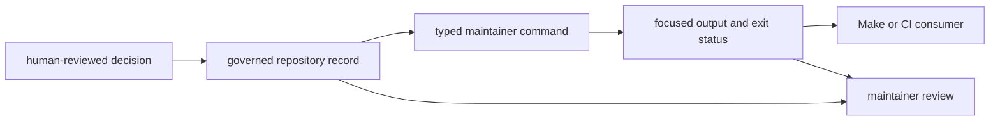
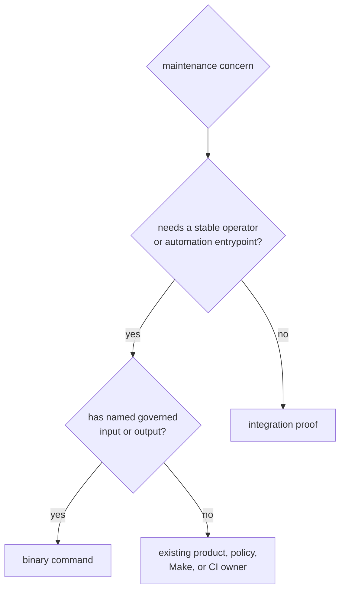

# Maintainer Workflow Foundations

`bijux-gnss-dev` is an unpublished repository-maintenance binary. It turns a
small set of reviewed local governance rules into repeatable commands for
maintainers and automation. It is not a general scripting bucket, a shared
policy authority, or a GNSS product library.

## The Current Trust Surface

| workflow | what a pass establishes | what it does not establish |
| --- | --- | --- |
| `audit-allowlist` | advisory exceptions have valid identifiers, owners, rationales, review links, and unexpired dates | the security risk is acceptable |
| `deny-policy-deviations` | local dependency-policy exceptions are attributable, time-bounded, and linked to standards review | upstream policy changed or the exception should become permanent |
| `audit-ignore-args` | valid advisory identifiers can be emitted in stable, deduplicated order for Cargo audit | exception records have complete ownership, rationale, links, or expiry |
| `bench-compare` | the curated benchmark set ran and current evidence was normalized; comparison occurred only if a baseline existed | performance passed a regression gate when no maintained baseline exists |

The validation and derivation commands are deliberately separate.
`audit-ignore-args` succeeds with empty output when its register is absent so a
caller can construct a safe command line. `audit-allowlist` treats the same
absence as a governance failure. Automation that needs both safety and record
quality must run both operations.

## Follow A Governed Workflow

The command validates or derives from a reviewed record. It does not create the
policy decision that justified the record.

## Start From The Maintenance Question

| question | guide |
| --- | --- |
| Which commands and options are stable? | [Command surface](../interfaces/command-surface.md) |
| Which local files are governed inputs? | [Governed input contracts](../interfaces/governed-input-contracts.md) |
| Which stdout, files, and exit states may automation consume? | [Output contracts](../interfaces/output-contracts.md) |
| How are commands composed by repository automation? | [Workflow contracts](../interfaces/workflow-contracts.md) |
| Does a proposed workflow belong in this binary? | [Ownership boundary](ownership-boundary.md) |
| What can current evidence not prove? | [Known limitations](../quality/known-limitations.md) |
| How is fast and slow test-lane policy protected? | [Repository test policy](../quality/repository-test-policy.md) |

## Command Or Integration Proof?

The binary exposes four commands. Slow-test roster coherence is not a fifth
command: an integration test executes the repository expression generator and
proves that the governed slow roster is sorted, unique, resolvable, present in
the slow expression, and excluded from the fast expression.

Do not add a command solely to wrap a shell line. A durable command needs a
repository-specific rule, named inputs and outputs, honest exit semantics, and
proof that cannot be owned more clearly by a product package or shared
standards repository.

## Benchmark Evidence Is Conditional

Benchmark comparison writes raw evidence and a normalized current snapshot. A
maintained baseline is required before threshold comparison can support a
regression claim. Without one, even strict mode reports an explicit skip and a
successful exit means only that the curated benchmarks executed and evidence
was written.

Use the [package overview](package-overview.md) for the concise role,
[scope and non-goals](scope-and-non-goals.md) for explicit refusals,
[durable naming](durable-naming.md) for repository-owned names, and
[change principles](change-principles.md) before extending the maintenance
surface.

Implementation evidence begins with the
[command reference](../../../crates/bijux-gnss-dev/docs/COMMANDS.md),
[governance input guide](../../../crates/bijux-gnss-dev/docs/GOVERNANCE_FILES.md),
[benchmark guide](../../../crates/bijux-gnss-dev/docs/BENCHMARKS.md),
[test guide](../../../crates/bijux-gnss-dev/docs/TESTS.md),
[command implementation](../../../crates/bijux-gnss-dev/src/main.rs), and
[suite-selection proof](../../../crates/bijux-gnss-dev/tests/integration_nextest_suite_selection.rs).
