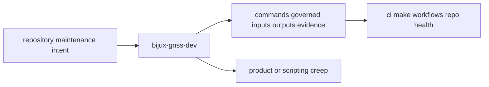

# Foundation

Open this section when the question is whether a maintainer workflow belongs in
`bijux-gnss-dev` at all, what repository-owned language this crate uses, and
how its scope fits inside the GNSS workspace.

## Boundary Model

The maintainer boundary is only trustworthy when readers can see where
reviewed repository workflows stop and where product behavior, ad hoc shell
convenience, or unmanaged side effects must stay out.

## Read These First

- open [Package Overview](package-overview.md) for the shortest accurate
  explanation of the crate
- open [Ownership Boundary](ownership-boundary.md) when a maintainer workflow
  is drifting toward product behavior
- open [Dependencies And Adjacencies](dependencies-and-adjacencies.md) when the
  question is whether a dependency or governed file belongs here

## The Mistake This Section Prevents

The most common mistake here is treating repository automation as harmless
glue. That is how unowned shell folklore becomes durable maintenance surface.
This section keeps reviewed maintainer workflows distinct from product logic
and from generic scripting that no crate should own.

## Pages In This Section

- [Package Overview](package-overview.md)
- [Scope And Non-Goals](scope-and-non-goals.md)
- [Ownership Boundary](ownership-boundary.md)
- [Durable Naming](durable-naming.md)
- [Repository Fit](repository-fit.md)
- [Domain Language](domain-language.md)
- [Dependencies And Adjacencies](dependencies-and-adjacencies.md)
- [Change Principles](change-principles.md)

## First Boundary Check

- this crate owns repository maintenance workflows, not product features
- this crate may read and validate governed inputs, but that does not make it a
  general repository-scripting bucket
- this crate may emit maintenance evidence, but it does not own arbitrary
  output policy

## First Proof Check

- `crates/bijux-gnss-dev/README.md`
- `crates/bijux-gnss-dev/docs/BOUNDARY.md`
- `crates/bijux-gnss-dev/src/main.rs`
- `crates/bijux-gnss-dev/tests/`
- `crates/bijux-gnss-policies/`

## Leave This Section When

- leave for [Architecture](../architecture/) when ownership is clear and the
  question becomes code layout
- leave for [Interfaces](../interfaces/) when the question is already about
  commands, governed inputs, or output contracts
- leave for [Quality](../quality/) when the boundary is clear and the question
  becomes whether the proof bar is strong enough
