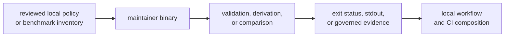
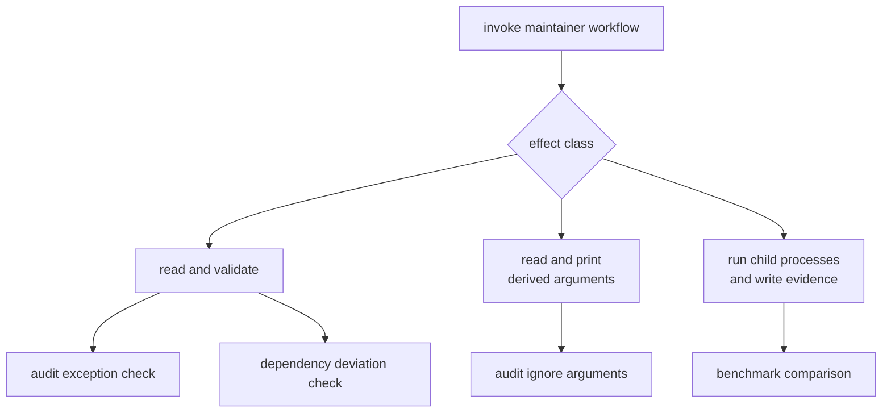
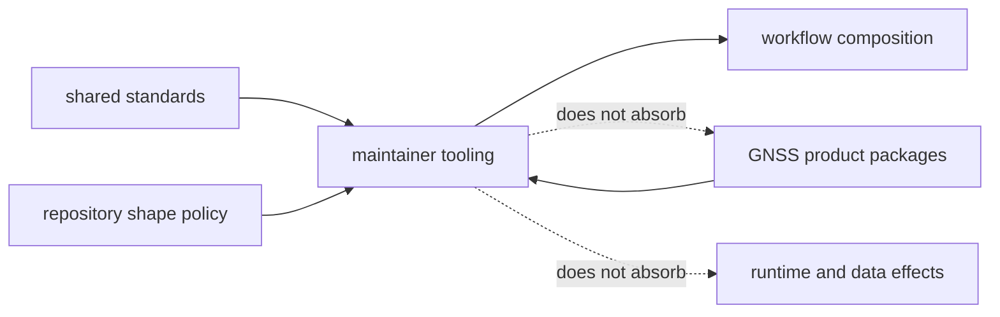

# Maintainer Tooling Overview

Repository rules are easiest to trust when the reviewed input, validation
logic, effects, and failure status are visible together. `bijux-gnss-dev`
provides that boundary for a small set of bijux-gnss maintenance workflows.
It replaces duplicated command fragments with one typed binary while leaving
policy approval with human reviewers.

The package is intentionally private and executable-only. Product packages do
not link to it, and releasing the GNSS libraries does not publish it.

## Why This Package Exists

Without a single owner, the same exception can be parsed differently by a Make
target, a CI workflow, and a local script. This package centralizes the
repository-specific interpretation. It does not centralize all automation and
does not become a generic utility crate.

## Owned Decisions

| responsibility | decision made here | decision left elsewhere |
| --- | --- | --- |
| security exception quality | whether each record has a valid identifier, rationale, owner, link, and unexpired date | whether the risk is acceptable |
| local dependency-policy deviation quality | whether each deviation is attributable, bounded, and linked to shared-standards review | what the shared dependency policy should be |
| audit argument derivation | which syntactically valid advisory identifiers become Cargo audit ignore arguments | whether the source exception should be approved |
| benchmark execution | which package benchmarks run, how their output is normalized, and how ratios are reported | whether a performance change is scientifically or operationally acceptable |
| nextest lane coherence | whether the slow roster resolves to tests and feeds the fast and slow expressions | which tests deserve slow-lane classification |

The lane-coherence responsibility is integration-test evidence, not a binary
subcommand. This distinction matters when locating a failure: command
dispatch cannot repair a malformed roster expression.

## Effect Classes

Read-only checks should not rewrite the governed records they inspect.
Argument derivation writes only to stdout. Benchmark comparison may create its
governed evidence locations and invoke Cargo benchmarks; no other current
workflow needs those permissions.

Use the [execution model](../architecture/execution-model.md) when reviewing a
new read, write, process invocation, environment dependency, or working-directory
assumption.

## Inputs Are Reviewed Policy

The package consumes three kinds of durable input:

- the [audit exception register](../../../audit-allowlist.toml);
- the [dependency-policy deviation register](../../../configs/rust/deny.deviations.toml);
- the curated benchmark inventory and optional maintained baseline.

Validation does not make an input trustworthy by itself. A well-formed
exception can still be a poor risk decision, and a well-formed baseline can
still come from an unsuitable machine or commit. Review establishes intent;
the binary protects shape, consistency, and repeatable execution.

The [governed input contract](../interfaces/governed-input-contracts.md)
describes compatibility expectations for these records.

## Outputs Carry Different Authority

| output kind | meaning | review use |
| --- | --- | --- |
| successful validation status | the inspected records satisfy implemented shape and expiry rules | proceed to the underlying audit or policy check |
| failure diagnostics | one or more records violate an implemented rule | repair or remove the record; do not bypass the command |
| derived audit arguments | sorted, deduplicated identifiers suitable for Cargo audit invocation | consume only after allowlist validation |
| benchmark stdout log | captured benchmark stdout from the current run | inspect measured output while using console stderr for execution diagnostics |
| normalized current snapshot | benchmark names and measured nanoseconds parsed from the run | compare only with a compatible maintained baseline |
| regression report | current measurements exceeded the selected ratio for names present in both snapshots | investigate context and product behavior |

No maintained benchmark baseline is present at this review. Consequently,
benchmark execution currently produces measurements but cannot establish a
repository regression pass. The
[receiver performance guide](../../05-bijux-gnss-receiver/operations/performance-and-profiling.md)
sets the interpretation boundary.

## Boundaries With Neighboring Owners

- Shared standards define common dependency and governance policy.
- The policy support package checks reusable repository-shape rules.
- Product packages own algorithms, public APIs, and their benchmark
  implementations.
- Make and CI compose maintainer commands into broader workflows.
- Infrastructure and runtime packages own product data, devices, captures, and
  operational artifacts.

The maintainer binary may inspect or execute a product benchmark without
owning the benchmarked algorithm. It may validate a local standards deviation
without redefining upstream policy.

## Place A New Workflow

A workflow belongs here only when all of the following are true:

1. Its consumer is a repository maintainer or repository automation.
2. It enforces or derives behavior from a named, reviewed repository contract.
3. Its effects can be stated narrowly and kept inside governed locations.
4. It benefits from typed parsing, deterministic ordering, or focused
   diagnostics.
5. It does not own reusable GNSS behavior or general-purpose automation.

Keep workflow composition in Make or CI when it only sequences existing
commands. Put reusable repository-shape checks in the policy support package.
Put scientific and runtime behavior in the product package that owns it.

## Current Constraints

- All command workflows currently share one implementation file. This is
  acceptable while their responsibilities and effects remain easy to isolate;
  split by governance and benchmark ownership if that stops being true.
- Audit argument derivation does not itself validate record rationale, owner,
  link, or expiry. Callers requiring a governance gate must run validation
  first.
- Benchmark strict mode has no comparison to enforce when the maintained
  baseline is absent.
- Slow-test lane policy is checked here but generated by repository tooling
  outside the binary.
- Date validation checks shape and ordering against the current day; it is not
  a full calendar parser.

These are operational boundaries, not hidden guarantees. Changes that remove
one should update the [command reference](../../../crates/bijux-gnss-dev/docs/COMMANDS.md),
[workflow guide](../../../crates/bijux-gnss-dev/docs/WORKFLOWS.md), and
[test evidence](../../../crates/bijux-gnss-dev/docs/TESTS.md) together.
