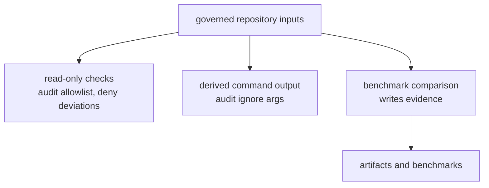

# Package Overview

`bijux-gnss-dev` owns maintainer-only repository workflows that are important
enough to be typed Rust commands instead of scattered shell fragments. It is a
binary boundary, not a reusable GNSS product API.

Use this handbook when the question is audit exceptions, deny-policy
deviations, audit-ignore argument derivation, benchmark comparison, suite
selection, or governed maintainer evidence.

## Workflow Split

## Owned Commands

| command | owns | writes |
| --- | --- | --- |
| `audit-allowlist` | validates `audit-allowlist.toml` advisory ids, rationale, owner, link, and expiry | none |
| `deny-policy-deviations` | validates `configs/rust/deny.deviations.toml` ids, owners, reasons, review links, and expiry | none |
| `audit-ignore-args` | derives `cargo audit --ignore ...` arguments from the reviewed allowlist | stdout only |
| `bench-compare` | runs the curated receiver and navigation benchmark set and compares against the checked baseline | `artifacts/benchmarks.txt`, `benchmarks/bencher_current.txt`, governed baseline when explicitly updated |

## Reader Rules

- Start here for maintainer workflow behavior, output locations, and
  governance checks.
- Leave for `bijux-gnss-policies` when the question is executable repository
  shape policy rather than this binary's command behavior.
- Leave for `configs/rust/deny.toml` and shared standards material when the
  question is upstream dependency policy, not local deviation validation.
- Leave for `bijux-gnss-receiver` or `bijux-gnss-nav` when a benchmark exposes
  product behavior rather than benchmark command policy.
- Leave for repository `Makefile` targets when the question is how this binary
  is composed into a broader local workflow.

## Output Discipline

Most commands here are checks, not generators. The exception is benchmark
comparison, which writes governed evidence so reviewers can distinguish:

- current-run evidence in `artifacts/`
- checked benchmark snapshots in `benchmarks/`
- reviewed governance inputs in `audit-allowlist.toml` and
  `configs/rust/deny.deviations.toml`

No maintainer command should create hidden or ad hoc output locations.

## First Proof Check

Inspect `crates/bijux-gnss-dev/README.md`,
`crates/bijux-gnss-dev/docs/COMMANDS.md`,
`crates/bijux-gnss-dev/docs/WORKFLOWS.md`,
`crates/bijux-gnss-dev/docs/OUTPUTS.md`,
`crates/bijux-gnss-dev/src/main.rs`, and the two integration tests under
`crates/bijux-gnss-dev/tests/`.
