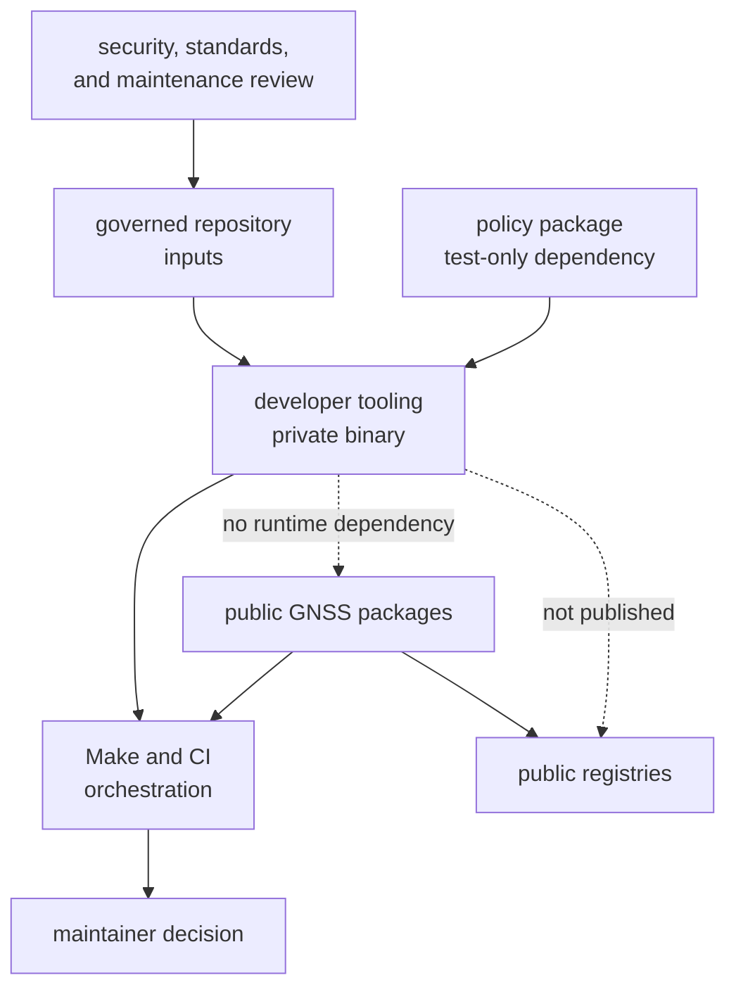
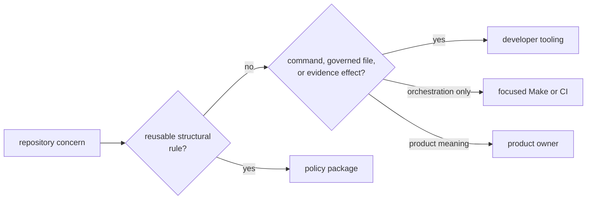

# Developer Tooling in the Workspace

`bijux-gnss-dev` is the repository’s private maintainer executable. It sits
beside product packages as a workspace member, but outside the public
dependency graph and release set. Make invokes it to enforce reviewed local
contracts; product packages do not import it.

## Workspace Placement

The [workspace release contract](../../../configs/release/crates.toml) assigns
the package the `maintainer-control-plane` role and explicitly denies
publication. Its [package manifest](../../../crates/bijux-gnss-dev/Cargo.toml)
also sets `publish = false` and declares only a binary target.

## Dependency Shape

| Direction | Current relationship | Boundary meaning |
| --- | --- | --- |
| runtime dependencies into developer tooling | `anyhow`, Clap, regex, and TOML parsing | general-purpose command, parsing, and comparison support |
| test dependency into developer tooling | policy package | package guardrail evaluation only |
| product packages into developer tooling | none | maintenance code cannot reach product internals through Rust dependencies |
| developer tooling into product packages | none | public/runtime packages cannot acquire maintainer-only behavior |
| Make into developer tooling | command invocation | orchestration consumes stable command, stdout, status, and evidence contracts |
| developer tooling into external tools | system date and Cargo benchmark processes | explicit effect boundaries, not package dependencies |

The benchmark command names receiver and navigation packages for Cargo
invocation, but it does not link their Rust APIs. Product owners retain
benchmark definitions and scientific meaning.

## Why This Is Not the Command Package

The public command package serves operators and owns user-facing GNSS
workflows. Developer tooling serves repository maintainers and owns local
governance mechanics. Moving audit exceptions, standards deviations, or
benchmark baseline management into the product command would:

- expose repository internals to product users
- couple public releases to local maintenance policy
- make a private validation change look like product compatibility
- invite product code to depend on maintainer state

Operator behavior belongs in the [command handbook](../../01-bijux-gnss/).
Developer tooling may remain private and change with repository governance,
subject to its Make and maintainer callers.

## Why This Is Not the Policy Package

The policy package provides reusable, read-only structural checks through a
Rust API. Developer tooling provides effectful commands over named repository
records and benchmark processes.

A content or dependency rule that many packages should invoke belongs in
policy. A typed validator for one reviewed repository ledger can belong in
developer tooling. Tool sequencing, target selection, caching, and report
assembly stay in Make or CI unless they acquire a durable typed command
contract.

## Inputs and Consumers

Current governed inputs are:

- the [security exception ledger](../../../audit-allowlist.toml)
- the [local standards deviation ledger](../../../configs/rust/deny.deviations.toml)
- the [slow-test ledger](../../../configs/rust/nextest-slow-roster.txt), through
  integration proof rather than a binary command
- an optional benchmark baseline, which is documented but not tracked in the
  current checkout

Current consumers are:

- the [repository audit workflow](../../../makes/rust.mk), which captures audit
  arguments and checks validator statuses
- the benchmark Make target, which maps strictness into command flags
- maintainers invoking commands directly
- reviewers inspecting diagnostics and generated benchmark evidence

No current GitHub workflow invokes the binary directly; CI reaches these
contracts through repository orchestration when the corresponding Make targets
run.

## Placement Invariants

Keep these properties true:

- the package remains private and binary-only
- runtime dependencies remain independent of GNSS product packages
- reusable structural rules stay in policy
- operator workflows stay in the public command owner
- datasets, run manifests, and product artifacts stay in infrastructure
- shared records, units, identities, and schemas stay in core
- benchmark science stays in receiver and navigation
- Make and CI retain orchestration and logging ownership
- every read, write, process, and machine-consumed output is explicit

The [maintainer ownership model](ownership-boundary.md) assigns neighboring
responsibilities. The [maintainer scope](scope-and-non-goals.md) provides the
admission test for a proposed capability.

## Detect Placement Drift

Review the package as misplaced when:

- a product manifest adds it as a dependency
- its runtime manifest adds a product package
- a reusable policy rule appears only inside a command
- a command begins producing operator-facing reports
- release configuration admits it to public publication
- general tool sequencing moves from Make into the binary without a stable
  interface
- evidence paths or governed inputs exist only in implementation

The [package guardrail integration](../../../crates/bijux-gnss-dev/tests/integration_guardrails.rs)
checks configured structural policy, but it does not prove every invariant
above. Manifest, release-contract, caller, and effect review remain necessary.
