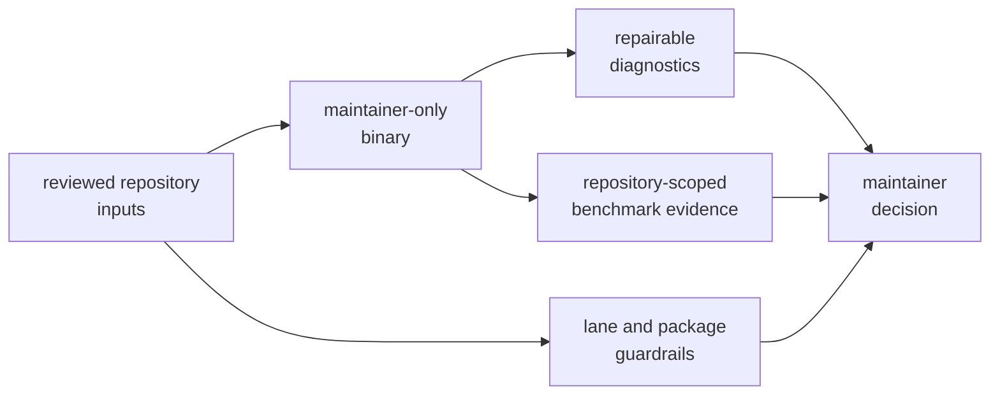
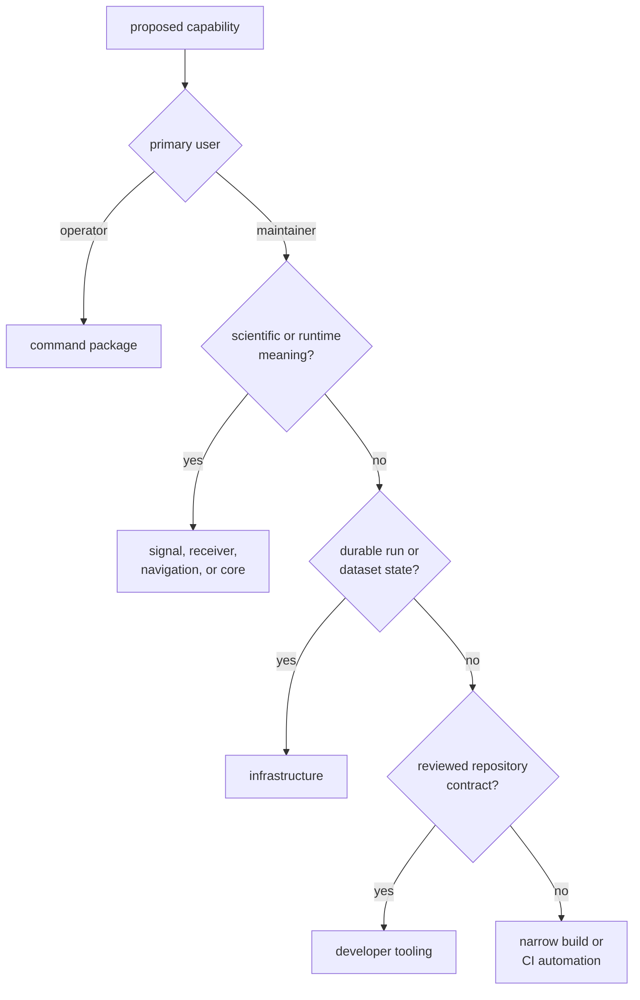

# Maintainer Tooling Scope

`bijux-gnss-dev` exists for repository governance that needs a typed,
reviewable implementation. It is a private binary package, not a reusable
library and not an operator-facing product command.

## Current Responsibility

The executable currently owns four commands:

| Capability | Input | Observable result |
| --- | --- | --- |
| security allowlist validation | reviewed advisory entries | success or field-specific validation failure |
| deny-deviation validation | reviewed local standards exceptions | success or ownership, review, expiry, or format failure |
| audit-ignore derivation | reviewed advisory identifiers | deterministic command arguments on standard output |
| benchmark comparison | curated benchmark set and optional baseline | raw evidence, normalized current snapshot, comparison diagnostics, and optional strict failure |

The package also contains integration guardrails for its package boundary and
for fast/slow nextest lane selection. Those are test-owned repository policy;
there is no slow-roster subcommand in the current binary.

The [command inventory](../../../crates/bijux-gnss-dev/docs/COMMANDS.md) defines
the executable surface, and the
[test guide](../../../crates/bijux-gnss-dev/docs/TESTS.md) defines the
guardrail surface.

## Ownership Test

A workflow belongs here only when all of these are true:

- its primary user is a repository maintainer or automation acting on behalf
  of maintainers
- it enforces or derives behavior from a reviewed repository contract
- typed parsing and diagnostics are more durable than an opaque shell fragment
- its reads, writes, subprocesses, and exit behavior can be stated precisely
- it does not need product runtime ownership to do its job

Convenience, repeated shell syntax, or repository-root invocation is not enough.

## Explicit Non-Goals

This package does not own:

- public GNSS commands, operator reports, or release interaction
- signal generation, acquisition, tracking, observations, or receiver runtime
- navigation products, corrections, positioning, integrity, PPP, or RTK
- dataset interpretation, run manifests, histories, or product artifact
  persistence
- shared domain records, identifiers, units, diagnostics, or schemas
- generic scripting that has no stable governed input or output
- a utility library for other packages to import

Product behavior must remain in the package that owns its semantics. A
maintainer command may invoke an existing product or build tool, but it must not
reimplement the product contract merely to make automation convenient.

## Route Work to the Correct Owner

Build and CI glue may remain in focused Make or workflow code when typed Rust
logic adds no durable contract. Moving every repeated command into the binary
would hide rather than clarify ownership.

## Effects Allowed Here

The binary may:

- read named governance files under a selected workspace root
- read benchmark baselines and current benchmark output
- invoke the curated Cargo benchmark targets
- print machine-consumable arguments and human-repairable diagnostics
- write benchmark run evidence under the artifact area
- write maintained benchmark snapshots under the benchmark area

Any new effect needs a declared path, lifecycle, failure mode, and consumer.
Hidden network access, writes outside governed locations, mutation of product
configuration, or dependence on ambient repository state beyond the declared
workspace root are outside the current contract.

## Boundary Warning Signs

Reconsider ownership when a proposal:

- requires importing a product crate to reach private runtime behavior
- emits a report intended for product users
- creates or interprets receiver run layout
- carries scientific thresholds or support policy
- is reusable by product packages as a library
- has no reviewed input, durable output, or stable maintenance decision
- needs broad filesystem or network access unrelated to its stated contract

Use the [maintainer boundary](../../../crates/bijux-gnss-dev/docs/BOUNDARY.md)
and [workflow guide](../../../crates/bijux-gnss-dev/docs/WORKFLOWS.md) to
resolve ambiguous proposals.

The scope is correct when a maintainer can name the governed input, typed
decision, explicit effects, output consumer, and reason the capability cannot
belong to a product or infrastructure owner.
