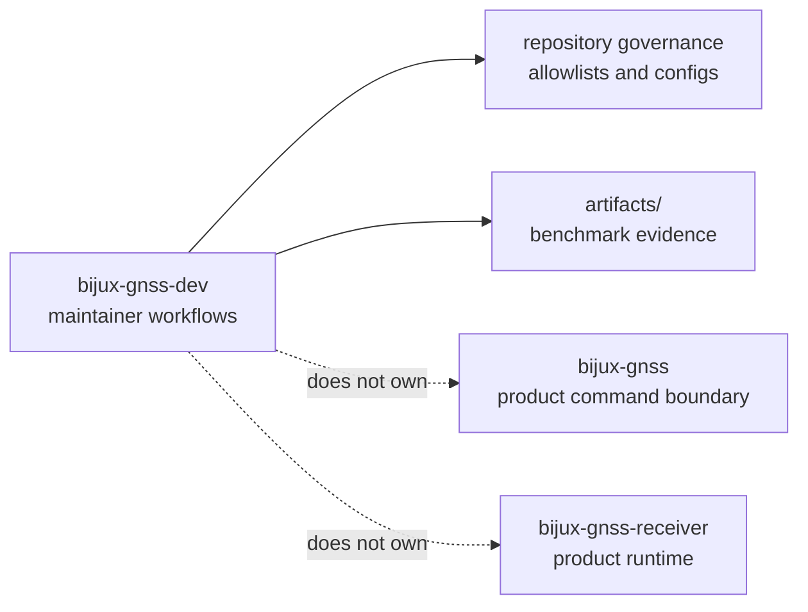

# bijux-gnss-dev

`bijux-gnss-dev` owns maintainer-only repository workflows for
`bijux-telecom`. This crate is not product behavior. It exists so governance
checks, audit policy enforcement, reviewed deviation handling, and benchmark
comparison workflows have a real owner instead of being scattered across shell
snippets and ad hoc scripts.

That boundary matters because maintainer tooling can quietly become a second
product if it is not constrained. This crate should protect repository health
without pretending to be reusable GNSS science or operator-facing behavior.

## Why This Package Exists

- reviewed audit and deny-policy exceptions should be validated by typed code,
  not by fragile command snippets
- benchmark comparison workflows need a repository-owned maintainer surface
- governance checks should stay separate from the public product command crate

## What It Owns

- validation for `audit-allowlist.toml`
- validation for reviewed dependency-policy deviation files
- derived maintainer commands that turn reviewed allowlists into exact tool
  arguments
- benchmark execution and comparison workflows that produce repository evidence

## What It Refuses

- public GNSS commands owned by `bijux-gnss`
- receiver execution owned by `bijux-gnss-receiver`
- signal science, navigation science, or shared GNSS contracts owned by the
  product crates
- general shell convenience with no durable repository-owner reason to exist

## Strongest Proof Surfaces

- crate README:
  [`crates/bijux-gnss-dev/README.md`](../../crates/bijux-gnss-dev/README.md)
- package docs:
  [`crates/bijux-gnss-dev/docs/COMMANDS.md`](../../crates/bijux-gnss-dev/docs/COMMANDS.md),
  [`crates/bijux-gnss-dev/docs/AUDIT_POLICY.md`](../../crates/bijux-gnss-dev/docs/AUDIT_POLICY.md),
  [`crates/bijux-gnss-dev/docs/BENCHMARKS.md`](../../crates/bijux-gnss-dev/docs/BENCHMARKS.md),
  [`crates/bijux-gnss-dev/docs/GOVERNANCE_FILES.md`](../../crates/bijux-gnss-dev/docs/GOVERNANCE_FILES.md)
- source root:
  [`crates/bijux-gnss-dev/src/main.rs`](../../crates/bijux-gnss-dev/src/main.rs)
- proof tests:
  [`crates/bijux-gnss-dev/tests`](../../crates/bijux-gnss-dev/tests)

## Start Here When

- the question is whether a maintainer workflow belongs in code rather than in
  shell or CI YAML
- the issue is audit allowlists, deny-policy deviations, or benchmark evidence
- the reader needs to know why a repository-only command exists and who should
  review it
- the concern is repository safety rather than runtime product behavior

## Reader Questions This Package Can Answer

- which governance files are treated as reviewed inputs
- how maintainer commands derive exact audit or policy-check behavior
- where benchmark comparison evidence is produced and why it belongs to
  maintainers rather than operators
- how the repository separates product surfaces from repository health tooling

## Leave This Handbook When

- the question becomes about operator-facing commands:
  [01-bijux-gnss](../01-bijux-gnss/)
- the question becomes about runtime execution or receiver artifacts:
  [05-bijux-gnss-receiver](../05-bijux-gnss-receiver/)
- the question becomes about datasets, run layout, or persisted experiment
  outputs:
  [03-bijux-gnss-infra](../03-bijux-gnss-infra/)

## First Proof Check

- `crates/bijux-gnss-dev/src/main.rs`
- `crates/bijux-gnss-dev/docs/COMMANDS.md`
- `crates/bijux-gnss-dev/docs/AUDIT_POLICY.md`
- `crates/bijux-gnss-dev/docs/BENCHMARKS.md`
- `crates/bijux-gnss-dev/tests/integration_guardrails.rs`
