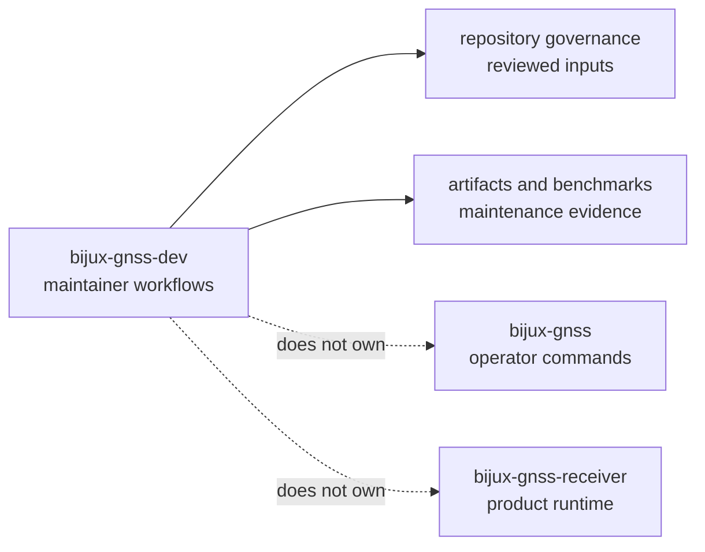

# bijux-gnss-dev

`bijux-gnss-dev` owns maintainer-only repository workflows for
`bijux-telecom`. This crate is not product runtime, GNSS science, or operator
workflow. It exists so governance checks, audit exception discipline,
nextest-roster guardrails, and benchmark-comparison workflows have a typed,
reviewable owner instead of living as shell folklore.

That boundary matters because maintainer tooling can quietly become a second
product if it is not constrained. This crate should protect repository health
without leaking product behavior into governance commands or turning repository
exceptions into unowned technical debt.

## Read These First

- open [Foundation](foundation/) when the question is why this crate should own
  a maintainer capability at all
- open [Interfaces](interfaces/) when the issue is already about commands,
  governed input files, or output locations
- open [Architecture](architecture/) when the question is how the binary
  organizes commands and repository effects in code
- open [Quality](quality/) when ownership is clear and the next question is
  whether the proof and review bar is strong enough

## Why This Package Exists

- reviewed security and policy exceptions should be validated by typed code,
  not by fragile shell snippets
- repository-scoped benchmark comparison needs an explicit maintainer owner
- nextest-roster and governance-file guardrails should stay out of product
  command crates
- maintainer workflows should emit evidence into governed locations rather than
  scattering incidental output across the repository

## What It Owns

- validation for `audit-allowlist.toml`
- validation for `configs/rust/deny.deviations.toml`
- derived `cargo audit --ignore ...` arguments from the reviewed allowlist
- benchmark execution, snapshot normalization, and baseline comparison for the
  curated maintainer benchmark set
- guardrail tests that defend repository-owned maintainer workflow boundaries

## What It Refuses

- public GNSS commands owned by `bijux-gnss`
- receiver execution and runtime artifacts owned by `bijux-gnss-receiver`
- signal science, navigation science, or shared GNSS contracts owned by the
  product crates
- generic shell convenience that has no durable repository-owner reason to
  exist

## Strongest Proof Surfaces

- crate README:
  [Maintainer crate README](../../crates/bijux-gnss-dev/README.md)
- crate-local docs:
  [Maintainer command guide](../../crates/bijux-gnss-dev/docs/COMMANDS.md),
  [Audit policy guide](../../crates/bijux-gnss-dev/docs/AUDIT_POLICY.md),
  [Benchmark governance guide](../../crates/bijux-gnss-dev/docs/BENCHMARKS.md),
  [Governed file guide](../../crates/bijux-gnss-dev/docs/GOVERNANCE_FILES.md),
  [Maintainer workflow guide](../../crates/bijux-gnss-dev/docs/WORKFLOWS.md)
- source root:
  [maintainer command source](../../crates/bijux-gnss-dev/src/main.rs)
- proof tests:
  [maintainer guardrail tests](../../crates/bijux-gnss-dev/tests/integration_guardrails.rs),
  [suite-selection tests](../../crates/bijux-gnss-dev/tests/integration_nextest_suite_selection.rs)

## Support Crates That Matter Here

- `bijux-gnss-policies` is the main adjacent support crate for maintainer work:
  it owns reusable repository guardrails while `bijux-gnss-dev` owns
  maintainer command workflows and evidence handling.
- `bijux-gnss-testkit` is not a maintainer-workflow owner, but benchmark and
  validation evidence in this crate can still depend on shared truth assets
  from it; inspect it when maintenance evidence is only meaningful relative to
  deterministic scientific fixtures.

## Sections In This Handbook

- [Foundation](foundation/) for role, scope, ownership, repository fit, and
  maintainer vocabulary
- [Architecture](architecture/) for command layout, effect model, dependency
  direction, and integration seams
- [Interfaces](interfaces/) for the binary command surface, governed files,
  output contracts, and compatibility expectations
- [Operations](operations/) for safe change sequence, local verification,
  evidence care, and review scope
- [Quality](quality/) for invariants, proof strategy, limitations, risk, and
  change validation
- [Maintainer workflow ownership boundaries](ownership-boundaries.md) for
  deciding whether repository automation belongs in the typed binary

## Start Here When

- the question is whether a repository-maintenance workflow belongs in code
  rather than CI YAML or shell
- the issue is audit allowlists, deny-policy deviations, or benchmark evidence
- the reader needs to know why a maintainer-only command exists and what it is
  allowed to read or write
- the concern is repository safety rather than product behavior

## Reader Questions This Package Can Answer

- which governance files are treated as reviewed maintainer inputs
- how maintainer commands derive exact audit or policy-check behavior
- where benchmark evidence is emitted and why it belongs to a maintainer crate
- how the repository separates product surfaces from repository-health tooling

## Leave This Handbook When

- the question becomes about operator-facing GNSS commands:
  [Command handbook](../01-bijux-gnss/)
- the question becomes about runtime execution or receiver artifacts:
  [Receiver handbook](../05-bijux-gnss-receiver/)
- the question becomes about persisted datasets, run layouts, or experiment
  evidence:
  [Infra handbook](../03-bijux-gnss-infra/)

## First Proof Check

- [maintainer command source](../../crates/bijux-gnss-dev/src/main.rs)
- [maintainer command guide](../../crates/bijux-gnss-dev/docs/COMMANDS.md)
- [audit policy guide](../../crates/bijux-gnss-dev/docs/AUDIT_POLICY.md)
- [benchmark governance guide](../../crates/bijux-gnss-dev/docs/BENCHMARKS.md)
- [output contract guide](../../crates/bijux-gnss-dev/docs/OUTPUTS.md)
- [maintainer guardrail tests](../../crates/bijux-gnss-dev/tests/integration_guardrails.rs)
- [suite-selection tests](../../crates/bijux-gnss-dev/tests/integration_nextest_suite_selection.rs)

## Design Pressure

If `bijux-gnss-dev` starts carrying product behavior, general scripting, or
repository effects that nobody is willing to document as a reviewed boundary,
it stops being honest maintainer tooling and becomes a hiding place for debt.
