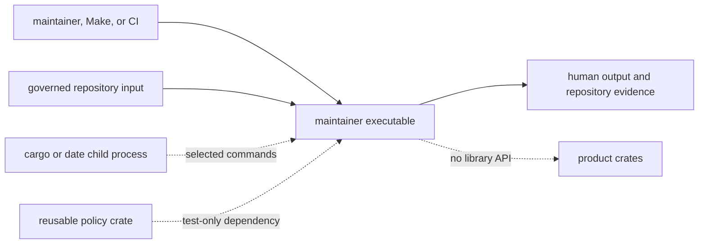
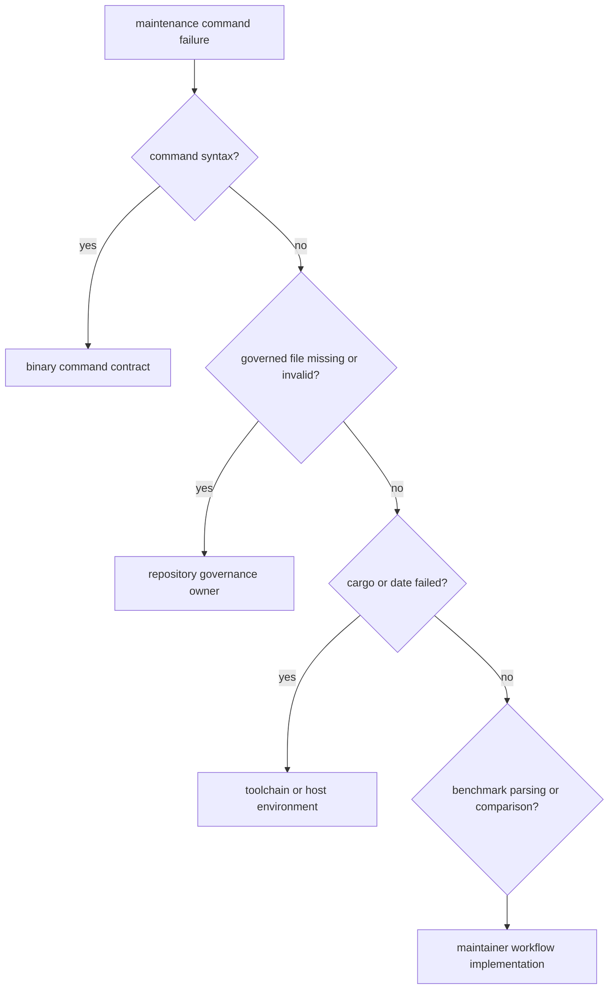

# Binary Boundary

`bijux-gnss-dev` is an executable for repository maintenance. It has no library
target. Its reusable contract is limited to documented command names,
arguments, governed inputs, filesystem effects, exit behavior, and
human-readable output.

## Boundary Shape

Product crates must not depend on source helpers from the executable. If logic
is reusable repository policy, move it to the policy owner. If it is GNSS
behavior, move it to the relevant product crate. If it is command orchestration
over governed repository state, it belongs here.

## What Callers Can Rely On

| contract | current guarantee | important limit |
| --- | --- | --- |
| executable identity | the package builds the `bijux-gnss-dev` binary | there is no library import surface |
| command inventory | four documented maintenance commands | there is no automated snapshot of the complete help text |
| repository resolution | each command accepts an optional workspace root and otherwise uses the current directory | no ancestor search discovers the repository |
| exit result | validation and strict benchmark failures return non-success | advisory benchmark regressions and missing benchmark baselines can still return success |
| display output | maintainers receive contextual pass, failure, and benchmark messages | text is human-oriented, not a versioned machine protocol |
| filesystem effects | benchmark evidence is written to documented repository locations | audit and deviation commands do not publish structured reports |

The [command surface](command-surface.md) records exact behavior. The
[dependency guide](../foundation/dependencies-and-adjacencies.md) explains the
external process and working-directory requirements.

## What Is Not A Public Contract

- helper function names and source organization;
- exact diagnostic wording or line order;
- a JSON error envelope or categorized numeric exit codes;
- benchmark output emitted by `cargo` before normalization;
- automatic repository-root discovery;
- product benchmark performance itself;
- the slow-test roster as a binary command.

The slow roster is currently governed by an integration test and expression
script, not by a `bijux-gnss-dev` subcommand. Do not document test-only
repository behavior as executable functionality.

## Failure Ownership

Preserve the distinction in automation. A malformed exception ledger is not a
toolchain failure, and a product benchmark failure is not automatically a
benchmark-parser defect.

## Boundary Evidence

The [source guardrail](../../../crates/bijux-gnss-dev/tests/integration_guardrails.rs)
checks repository policy for this binary and deliberately disables the
library-style public re-export rule. The
[slow-lane integration evidence](../../../crates/bijux-gnss-dev/tests/integration_nextest_suite_selection.rs)
checks roster and nextest expression behavior. Neither test invokes all four
commands as external processes.

When command syntax, output, or exit semantics become compatibility-critical,
add process-level tests for that behavior rather than citing these structural
tests.
