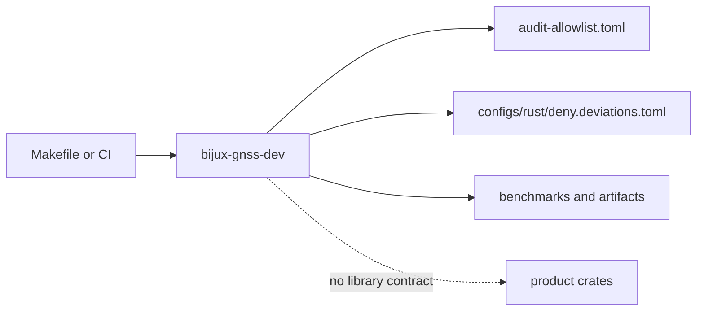

# Binary Boundary

`bijux-gnss-dev` is a repository-maintenance binary. Its public contract is the
command line and the governed files those commands read or write. Product crates
must not depend on its internals, and reviewers should treat any pressure to
reuse `src/main.rs` helpers as a sign that reusable ownership belongs somewhere
else.

## What Callers May Rely On

- the binary name `bijux-gnss-dev`
- the command inventory documented in
  `crates/bijux-gnss-dev/docs/COMMANDS.md`
- the governed inputs and outputs named by the maintainer workflows
- exit status and human-readable pass/fail output for the documented
  validation commands

## What Callers Must Not Assume

- that internal helper functions are a reusable API
- that the crate will expose `lib.rs`
- that product crates should depend on maintainer internals instead of their
  own owning surfaces

## Boundary Flow

The binary may inspect repository files and emit repository-scoped evidence.
It should not become a library dependency, a source of GNSS product behavior,
or an unreviewed escape hatch around governed configuration.

## Command Contract

| command | durable promise | not promised |
| --- | --- | --- |
| `audit-allowlist` | validates advisory identifiers, owner, reason, link, and expiry in `audit-allowlist.toml` | deciding whether a vulnerability is acceptable |
| `deny-policy-deviations` | validates local cargo-deny deviations are explicit and tied to standards review | changing shared standards policy |
| `audit-ignore-args` | derives `cargo audit --ignore` flags from the reviewed allowlist | duplicating audit exception policy in CI |
| `bench-compare` | runs the owned benchmark set and compares the normalized snapshot to baseline when available | proving all runtime or navigation performance behavior |

## Protecting Proof

- `crates/bijux-gnss-dev/src/main.rs`
- `crates/bijux-gnss-dev/docs/PUBLIC_API.md`
- `crates/bijux-gnss-dev/docs/COMMANDS.md`
- `crates/bijux-gnss-dev/docs/WORKFLOWS.md`
- `crates/bijux-gnss-dev/tests/integration_guardrails.rs`
