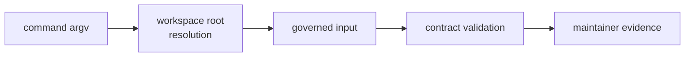

# Command Entry Contracts

Each command has a narrow entry contract. The command should explain which
governed repository contract it checked, where it read input, and what evidence
the maintainer can trust.

## Entry Contract Flow

## Command-Specific Shape

| command | required contract | output standard |
| --- | --- | --- |
| `audit-allowlist` | exception records use valid advisory ids, owners, links, reasons, and future expiries | diagnostics name the bad advisory |
| `deny-policy-deviations` | deviations have owner, reason, review link, and expiry tied to standards work | diagnostics name the bad deviation |
| `audit-ignore-args` | derived flags come only from reviewed allowlist records | output is suitable for CI consumption |
| `bench-compare` | benchmark snapshots compare against the governed baseline | strict mode fails on configured regressions |

## Shared Entry Expectations

- Accept `--workspace-root` when repository root resolution is required.
- Fail with the governed contract name, not only a parsing error.
- Keep successful validation output simple and automation-friendly.
- Write current-run benchmark evidence to documented generated locations.
- Do not add hidden reads or writes outside governed repository paths.

## First Proof Check

Inspect `crates/bijux-gnss-dev/src/main.rs`,
`crates/bijux-gnss-dev/docs/COMMANDS.md`,
`crates/bijux-gnss-dev/docs/WORKFLOWS.md`, and
`crates/bijux-gnss-dev/docs/GOVERNANCE_FILES.md`.
