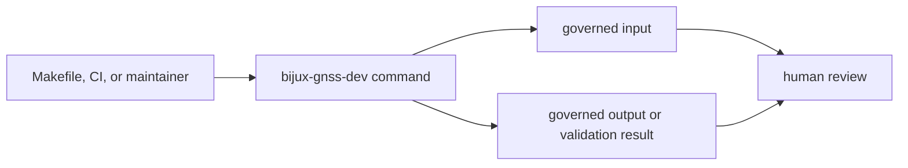

# Command Surface

The durable public surface of `bijux-gnss-dev` is its binary command set. Each
command exists because a repository-maintenance rule needs typed validation or
repeatable evidence. This page is the fast route from command name to governed
input, governed output, and proof.

## Command Map

| command | governed input | governed output | proof focus |
| --- | --- | --- | --- |
| `audit-allowlist` | `audit-allowlist.toml` | pass/fail validation output | advisory ids, owner, reason, link, and expiry are reviewable |
| `deny-policy-deviations` | `configs/rust/deny.deviations.toml` | pass/fail validation output | local cargo-deny exceptions remain attributable and tied to standards review |
| `audit-ignore-args` | `audit-allowlist.toml` | `cargo audit --ignore ...` arguments on stdout | CI derives ignores from the reviewed allowlist instead of duplicating policy |
| `bench-compare` | benchmark baseline and curated bench inventory | `artifacts/benchmarks.txt` and `benchmarks/bencher_current.txt` | normalized benchmark output is compared to baseline when available |

## Surface Flow

The public promise is deliberately small: stable command names, documented
inputs, documented outputs, and honest exit status. Internal helper names,
module structure, parsing functions, and benchmark implementation details are
not public API.

## Review Rules

- Adding a command requires a named governed input or output.
- Changing a command requires updating `crates/bijux-gnss-dev/docs/COMMANDS.md`
  and any affected workflow or output docs.
- A command must not reach into product internals when a product crate should
  own the reusable behavior.
- A command must not duplicate policy already governed by `bijux-std`; it may
  validate a local repository exception only when that exception is explicit.

## Protecting Proof

- `crates/bijux-gnss-dev/src/main.rs`
- `crates/bijux-gnss-dev/docs/COMMANDS.md`
- `crates/bijux-gnss-dev/docs/CONTRACTS.md`
- `crates/bijux-gnss-dev/docs/WORKFLOWS.md`
- `crates/bijux-gnss-dev/docs/OUTPUTS.md`
