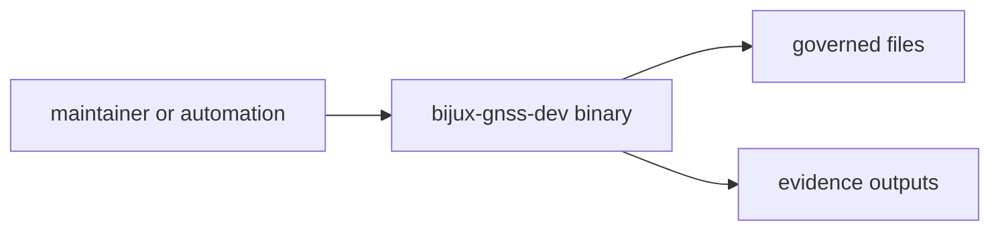

# Compatibility Commitments

`bijux-gnss-dev` is small in code and important in workflow impact. Its
compatibility promise is the binary command contract, not a Rust API.

## Compatibility Surface

## Commitments

| surface | compatibility promise | review risk |
| --- | --- | --- |
| command inventory | command names and meanings stay explicit and documented | automation breaks silently |
| governed inputs | file locations and schema expectations remain reviewable | policy exceptions drift |
| evidence outputs | generated and accepted evidence locations stay separated | reviewers trust stale or transient data |
| diagnostics | failures name the violated maintainer contract | maintainers fix symptoms instead of policy |
| binary boundary | no reusable Rust API is promised | product crates couple to maintainer internals |

## Explicit Non-Commitments

- internal helper layout inside `main.rs` is not a caller promise
- the crate does not promise a reusable Rust API
- product crates are not expected to integrate with this crate as a library

## Change Discipline

- Treat command meaning changes as maintainer workflow changes.
- Update governed input and output docs with any command that reads or writes a
  repository file.
- Keep `--workspace-root` behavior stable for automation that resolves files
  outside the current directory.
- Move reusable product behavior to the owning product crate instead of adding a
  library surface here.

## First Proof Check

Inspect `crates/bijux-gnss-dev/docs/CONTRACTS.md`,
`crates/bijux-gnss-dev/docs/PUBLIC_API.md`,
`crates/bijux-gnss-dev/docs/WORKFLOWS.md`, and
`crates/bijux-gnss-dev/docs/COMMANDS.md`.
