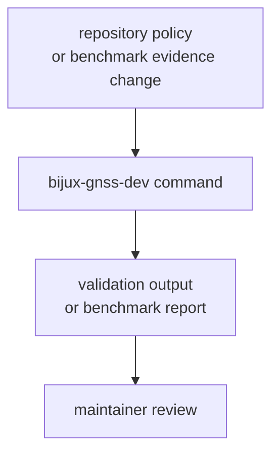

# Entrypoints and Examples

Use these entrypoints when choosing the right maintainer command. This crate is
a binary boundary; there is no Rust library API to call from product crates.

## Maintainer Route

## Command Selection

| maintainer question | command | evidence produced |
| --- | --- | --- |
| Are reviewed audit exceptions valid and unexpired? | `audit-allowlist` | pass/fail over `audit-allowlist.toml` |
| Which cargo-audit ignore flags are allowed? | `audit-ignore-args` | derived `cargo audit --ignore` arguments |
| Are dependency-policy deviations still reviewed? | `deny-policy-deviations` | pass/fail over `configs/rust/deny.deviations.toml` |
| Did benchmark evidence regress beyond the allowed threshold? | `bench-compare --strict` | artifacts and benchmark snapshot comparison |

## Example Sequence

If a maintainer updates a reviewed security exception, the durable sequence is:

1. edit `audit-allowlist.toml`
2. run `bijux-gnss-dev audit-allowlist`
3. run `bijux-gnss-dev audit-ignore-args` if automation consumes the derived
   flags

If a maintainer changes benchmark evidence, the durable sequence is:

1. run the benchmark comparison workflow
2. inspect current evidence under `artifacts/`
3. update `benchmarks/bencher_baseline.txt` only when the new baseline is
   intentionally accepted

## First Proof Check

Inspect `crates/bijux-gnss-dev/docs/COMMANDS.md`,
`crates/bijux-gnss-dev/docs/WORKFLOWS.md`,
`crates/bijux-gnss-dev/docs/PUBLIC_API.md`, and
`crates/bijux-gnss-dev/src/main.rs`.
