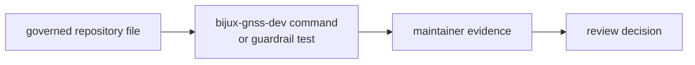

# Governed Input Contracts

This binary consumes a narrow set of reviewed repository inputs. Each input is
governed because it can change maintainer decisions without changing product
code.

## Input Governance Flow

## Governed Inputs

| input | contract meaning | proof owner |
| --- | --- | --- |
| `audit-allowlist.toml` | reviewed cargo-audit exception surface | `audit-allowlist` command |
| `configs/rust/deny.deviations.toml` | reviewed dependency-policy deviation surface | `deny-policy-deviations` command |
| `benchmarks/bencher_baseline.txt` | benchmark baseline used for regression comparison | `bench-compare` command |
| `configs/rust/nextest-slow-roster.txt` | curated slow-test roster for suite selection | `integration_nextest_suite_selection.rs` |

## Contract Rule

These files are not generic config bags. They are reviewed repository contracts
whose shape and meaning are part of the maintainer workflow surface.

## Boundary Decisions

- Keep command-consumed governed inputs explicit in `src/main.rs`.
- Keep guarded-but-not-command-consumed files documented with their test owner.
- Do not add path constants for important repository files without naming the
  review contract here.
- Do not put product crate configuration under this crate unless the maintainer
  command truly owns the policy check.
- Treat schema drift as a review event, not as harmless test maintenance.

## First Proof Check

Inspect `crates/bijux-gnss-dev/src/main.rs`,
`crates/bijux-gnss-dev/docs/GOVERNANCE_FILES.md`,
`crates/bijux-gnss-dev/docs/BENCHMARKS.md`, and
`crates/bijux-gnss-dev/tests/integration_nextest_suite_selection.rs`.
