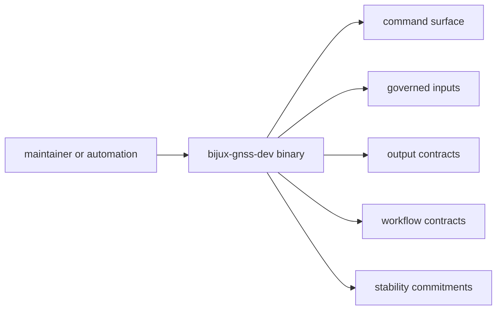

# Interfaces

Open this section when the question is what `bijux-gnss-dev` publicly promises
to maintainers and repository automation.

## Contract Surface

`bijux-gnss-dev` does not publish a library API, but it still exposes a real
maintainer contract through its binary command surface: governed inputs,
command entry behavior, emitted evidence, workflow expectations, and stability
limits.

## Read These First

- open [Command Surface](command-surface.md) first when the question is which
  maintainer commands exist
- open [Governed Input Contracts](governed-input-contracts.md) when the question
  is what repository files this binary treats as reviewed inputs
- open [Output Contracts](output-contracts.md) when the question is where
  maintenance evidence is emitted

## Pages In This Section

- [Command Surface](command-surface.md)
- [Governed Input Contracts](governed-input-contracts.md)
- [Output Contracts](output-contracts.md)
- [Stability Commitments](stability-commitments.md)
- [Binary Boundary](binary-boundary.md)
- [Command Entry Contracts](command-entry-contracts.md)
- [Workflow Contracts](workflow-contracts.md)
- [Entrypoints And Examples](entrypoints-and-examples.md)
- [Compatibility Commitments](compatibility-commitments.md)

## First Proof Check

- `crates/bijux-gnss-dev/src/main.rs`
- `crates/bijux-gnss-dev/docs/COMMANDS.md`
- `crates/bijux-gnss-dev/docs/GOVERNANCE_FILES.md`
- `crates/bijux-gnss-dev/docs/OUTPUTS.md`
- `crates/bijux-gnss-dev/docs/WORKFLOWS.md`

## Leave This Section When

- leave for [Foundation](../foundation/) when the question is whether a
  maintainer contract belongs in code at all
- leave for [Architecture](../architecture/) when the question is about code
  organization rather than maintainer contract
- leave for [Operations](../operations/) or [Quality](../quality/) when the
  interface is clear and the next question is safe change or proof
