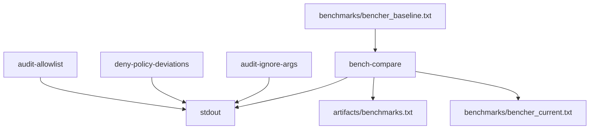

# Output Contracts

`bijux-gnss-dev` has a deliberately small output surface. Most commands are
read-only governance checks. `audit-ignore-args` writes derived arguments to
stdout. `bench-compare` writes governed benchmark evidence.

## Output Flow

## Owned Output Locations

| location | meaning | writer |
| --- | --- | --- |
| stdout from governance checks | pass/fail evidence for local and CI workflows | `audit-allowlist`, `deny-policy-deviations` |
| stdout from ignore derivation | reviewed `cargo audit --ignore ...` arguments | `audit-ignore-args` |
| `artifacts/benchmarks.txt` | raw benchmark run evidence for the current execution | `bench-compare` |
| `benchmarks/bencher_current.txt` | normalized current benchmark snapshot | `bench-compare` |
| `benchmarks/bencher_baseline.txt` | checked comparison baseline, updated only by reviewed benchmark-baseline work | reviewer-managed baseline changes |

## Boundary Rules

- Audit and deny-policy validation must remain read-only.
- `audit-ignore-args` must derive from the reviewed allowlist instead of
  duplicating exception state.
- Benchmark evidence may be written only to governed repository locations.
- Product crates own the behavior being benchmarked; dev owns the comparison
  workflow and evidence layout.

## Reader Checks

- Which command wrote the output?
- Is the output raw evidence, normalized current state, or checked baseline?
- Can reviewers reproduce the output from the documented command?
- Did a command create a new output location that should be documented first?

## First Proof Check

Inspect `crates/bijux-gnss-dev/docs/OUTPUTS.md`,
`crates/bijux-gnss-dev/docs/BENCHMARKS.md`,
`crates/bijux-gnss-dev/src/main.rs`, and the integration tests under
`crates/bijux-gnss-dev/tests/`.
