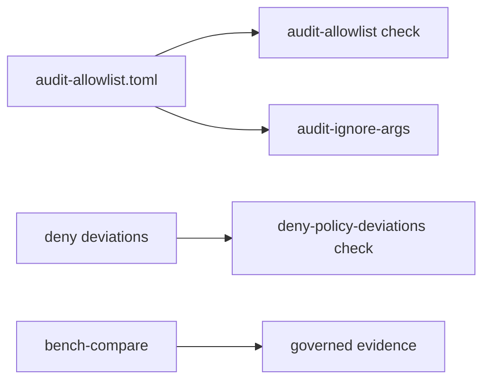

# Workflow Contracts

`bijux-gnss-dev` commands are small because each command owns one narrow
maintenance workflow. The contract is not command size; it is that repository
checks, derived audit arguments, and benchmark evidence are typed, reviewable,
and reproducible.

## Workflow Map

## Contract Families

| workflow | guarantee | failure means |
| --- | --- | --- |
| audit allowlist | every security exception has a valid advisory id, rationale, owner, link, and unexpired review date | the repository is hiding or aging an audit exception |
| deny-policy deviations | every local dependency-policy deviation has an owner, reason, upstream standards link, and unexpired review date | local policy drift is no longer reviewable |
| audit-ignore derivation | automation consumes ignore arguments from the same reviewed allowlist maintainers validate | CI or Makefile exceptions may diverge from reviewed state |
| benchmark comparison | receiver and navigation benchmark evidence is rerunnable, normalized, and compared against a checked baseline | performance evidence is not reproducible or violates the configured threshold |

## Boundary Rules

- This crate owns workflow validation logic, not upstream dependency policy.
- This crate owns benchmark comparison mechanics, not receiver or navigation
  algorithm performance claims.
- Makefile and CI may call these commands, but they should not duplicate their
  validation rules in shell.
- Any new maintainer workflow needs a named input, named output, and testable
  failure mode before it belongs here.

## Reader Checks

- What governed input does the workflow read?
- What output does it produce, if any?
- What exact condition makes it fail?
- Which repository owner must review a changed exception, deviation, or
  benchmark baseline?

## First Proof Check

Inspect `crates/bijux-gnss-dev/docs/WORKFLOWS.md`,
`crates/bijux-gnss-dev/docs/CONTRACTS.md`,
`crates/bijux-gnss-dev/docs/COMMANDS.md`,
`crates/bijux-gnss-dev/src/main.rs`,
`crates/bijux-gnss-dev/tests/integration_guardrails.rs`, and
`crates/bijux-gnss-dev/tests/integration_nextest_suite_selection.rs`.
