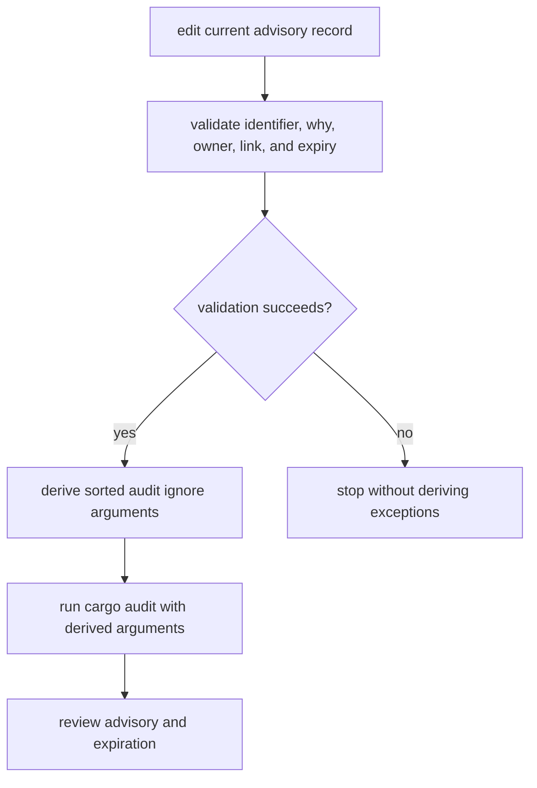
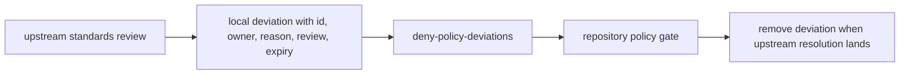
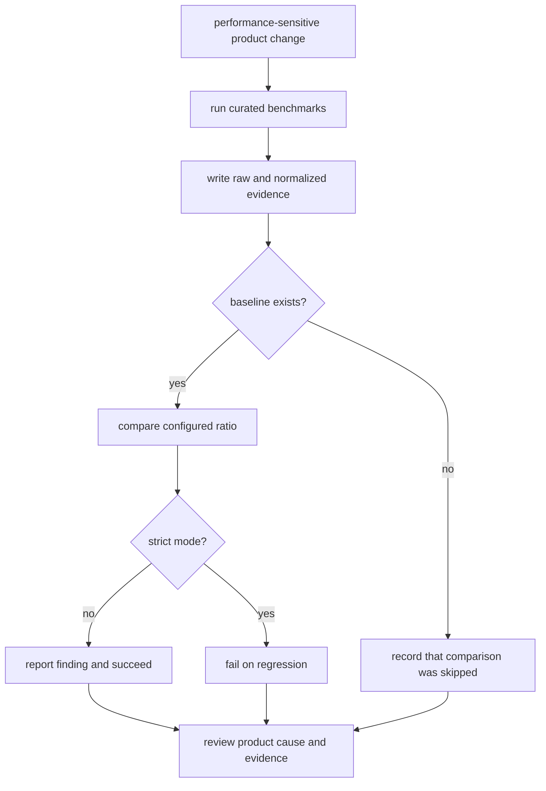

# Workflow Contracts

Maintainer workflows are safe only when validation, derivation, execution, and
review happen in the right order. A command returning success does not always
mean a gate was evaluated: missing optional input and advisory modes are
intentional states that callers must distinguish.

## Security Exception Workflow

The derivation command is not a validator. Safe automation must:

1. require the audit exception ledger;
2. run `audit-allowlist`;
3. stop on validation failure;
4. run `audit-ignore-args`;
5. pass the resulting arguments to the audit tool without maintaining a second
   exception list.

Current advisory records use `why`, owner, link, and expiry. Legacy ignore-only
entries are consumed by derivation but do not receive the same governance
validation. Migrate them before treating the workflow as fully reviewed.

The [audit policy](../../../crates/bijux-gnss-dev/docs/AUDIT_POLICY.md) defines
the human review expectation.

## Local Standards Deviation Workflow

The review link must use HTTP(S) and reference `bijux-std`. This command checks
that local deviations remain attributable and time-bounded; it does not decide
shared policy or update synchronized standards. Empty deviation lists are valid.

## Benchmark Evidence Workflow

Use non-strict mode for investigation and strict mode for a gate. In either
mode, reviewers need the baseline identity, threshold, toolchain, benchmark
inventory, and raw evidence. A successful run without a baseline is execution
evidence, not regression evidence.

The [benchmark contract](../../../crates/bijux-gnss-dev/docs/BENCHMARKS.md) and
[output contract](../../../crates/bijux-gnss-dev/docs/OUTPUTS.md) define the
reviewed files.

## Slow-Test Lane Governance

The [slow-test roster](../../../configs/rust/nextest-slow-roster.txt) is
validated by the
[lane selection integration test](../../../crates/bijux-gnss-dev/tests/integration_nextest_suite_selection.rs).
That evidence checks sorted uniqueness, resolution to known test functions, and
agreement between fast and slow nextest expressions.

This is a repository test workflow, not one of the binary’s four commands.
Changes to the roster must update lane evidence, but they do not expand the
public command surface.

## Add A Maintainer Workflow

A new workflow belongs in this executable only when it has:

- a repository-maintenance owner rather than product behavior;
- a named governed input or explicit no-input contract;
- documented output, filesystem effects, and missing-input behavior;
- a failure mode that tells maintainers what to correct;
- deterministic behavior suitable for local and CI use;
- process-level evidence for observable command behavior;
- no duplicated rule already owned by shared standards or the policy crate.

Update the [binary boundary](binary-boundary.md),
[command surface](command-surface.md), and crate-local
[workflow guide](../../../crates/bijux-gnss-dev/docs/WORKFLOWS.md) together when
the command inventory changes.
