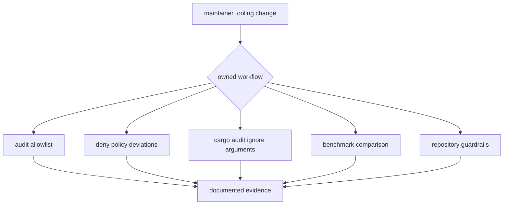

# Change Sequence

Use this sequence when modifying `bijux-gnss-dev` maintainer workflows. This
crate exists to make repository governance and benchmark evidence explicit; it
must not become a product CLI, a general shell bucket, or a hidden writer.

## Workflow Routing

1. Identify the owned maintainer workflow.
2. Name the governed inputs, outputs, and external commands the workflow uses.
3. Read the matching crate-local docs before editing `src/main.rs`.
4. Change one command path and only the closely coupled tests or docs.
5. Run the narrowest honest verification command for that workflow.
6. Confirm that the governed input or output contract docs still match the
   changed behavior

## Why This Order Matters

The wrong order usually produces one of two failures: a command changes meaning
without updating its documented governance contract, or a green test run proves
something adjacent instead of the actual maintained workflow.

## Proof Selection

| changed workflow | read first | proof |
| --- | --- | --- |
| audit allowlist validation | `AUDIT_POLICY.md`, `GOVERNANCE_FILES.md` | `cargo run -p bijux-gnss-dev -- audit-allowlist` |
| deny-policy deviation validation | `GOVERNANCE_FILES.md`, `COMMANDS.md` | `cargo run -p bijux-gnss-dev -- deny-policy-deviations` |
| audit ignore argument emission | `AUDIT_POLICY.md`, `OUTPUTS.md` | command output assertion or focused integration proof |
| benchmark comparison | `BENCHMARKS.md`, `OUTPUTS.md`, `WORKFLOWS.md` | benchmark comparison test or explicit benchmark run under `artifacts/` |
| repository guardrail behavior | `TESTS.md`, `BOUNDARY.md` | `cargo test -p bijux-gnss-dev --test integration_guardrails` |

## Reader Check

The final change should make the governed file, command, emitted output, and
proof visible. If the workflow cannot name those four surfaces, it is not ready
for this crate.
