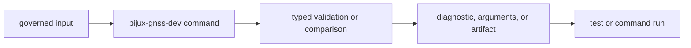

# Common Workflows

`bijux-gnss-dev` is for maintainers, not operators. Each workflow below either
validates a governed repository file, emits repository-scoped evidence, or
guards the repository shape.

## Workflow Families

| workflow | owned input | owned output | reader-facing risk |
| --- | --- | --- | --- |
| audit exception validation | `audit-allowlist.toml` | diagnostics and pass/fail status | expired or unexplained advisory exceptions become silent debt |
| deviation governance validation | `configs/rust/deny.deviations.toml` | diagnostics and pass/fail status | standards exceptions lose owner, link, or expiry discipline |
| audit ignore arguments | reviewed audit allowlist | `cargo audit --ignore ...` arguments | automation ignores advisories that were not reviewed |
| benchmark comparison | benchmark run output and checked-in baseline | evidence under `artifacts/` and regression status | performance changes cannot be compared honestly |
| repository guardrails | repository source tree | integration guardrail result | maintainer tooling starts owning product behavior or weak structure |

## Workflow Evidence

## Workflow Rule

Choose the workflow based on the owned maintainer surface. A benchmark-evidence
change is reviewed differently from a governed-TOML validation change even if
both happen in the same binary. The audit and deviation workflows are read-only
contract checks; `bench-compare` is the write-producing evidence workflow.

## Change Guidance

- Read `crates/bijux-gnss-dev/docs/WORKFLOWS.md` before changing command
  meaning.
- Read `BENCHMARKS.md` before changing benchmark package selection, baseline
  comparison, threshold handling, or artifact output.
- Read `GOVERNANCE_FILES.md` before changing TOML validation rules.
- Read `OUTPUTS.md` before changing emitted diagnostics, generated arguments,
  or artifact paths.
- Inspect the matching command path in `crates/bijux-gnss-dev/src/main.rs`
  before deciding whether an edit belongs to one workflow family.

## Rejection Cues

- The proposed command is useful but not tied to a governed repository file or
  benchmark evidence.
- The implementation would write outside `artifacts/` or another governed
  output location.
- The change pulls GNSS product crates into maintainer tooling to bypass a typed
  product interface.
