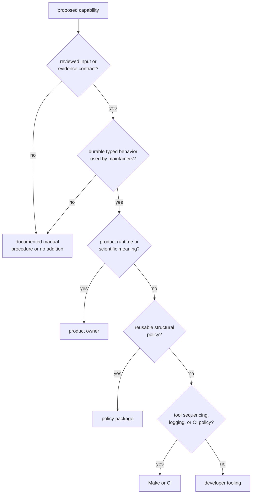
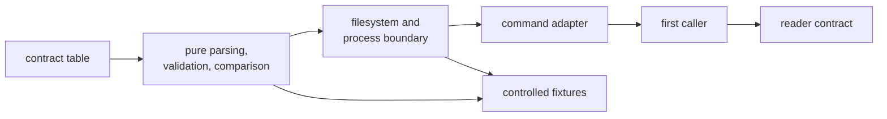

# Contributing Maintainer Workflows

Contribute here when a reviewed repository decision needs typed validation,
deterministic derivation, or bounded maintenance evidence. Convenience alone is
not enough. A new command creates a compatibility surface and an ongoing
obligation to test inputs, effects, callers, and failure behavior.

## Admission Test

An accepted capability must be explainable as:

> Given this reviewed repository input or evidence source, produce this
> validation, deterministic adapter output, or maintenance comparison for this
> named caller.

If the sentence cannot name all three surfaces, ownership is still unresolved.

## Design the Contract Before the Parser

Define:

| Concern | Required decision |
| --- | --- |
| authority | who reviews the input’s meaning, not merely its syntax |
| root | whether callers must pass a workspace root and what the default means |
| schema | required, optional, unknown, legacy, empty, and duplicate fields |
| time | timezone, date source, expiry boundary, and clock failure |
| output | human text versus exact machine-consumed stdout |
| status | which validation findings and external failures are non-zero |
| writes | destination, replacement or append behavior, atomicity, and partial failure |
| subprocess | executable, arguments, environment, working directory, and captured streams |
| compatibility | callers and governed files that must migrate together |
| evidence | deterministic automated proof and any environment-qualified manual proof |

Do not let current implementation accidents answer these questions silently.
For example, the existing commands default to the process current directory
rather than discovering the repository, and the audit argument adapter treats
a missing ledger differently from the validator.

## Implement by Workflow Ownership

Prefer pure functions for schema validation, normalization, and comparison so
negative cases do not require mutating the live repository or running expensive
benchmarks. Keep filesystem and subprocess effects at a narrow boundary.

The command implementation is currently concentrated in one binary source
file. Do not extend that flat shape indefinitely. When a workflow gains enough
parsing, domain rules, and effect handling to obscure other commands, split it
by durable responsibility such as audit governance or benchmark evidence, not
by delivery order or generic helper buckets. Keep the package binary-only
unless another repository owner has a legitimate reusable API need.

## Prove Behavior, Not the Happy File

Use controlled temporary workspaces for command behavior. At minimum, cover:

- valid, empty, absent, and malformed input
- every required field and constrained value
- multiple findings and deterministic finding order
- boundary dates and failure to obtain the date
- duplicate and legacy records where supported
- stdout with no incidental commentary when a shell caller parses it
- write creation, replacement, permission failure, and partial execution
- child-process success, non-zero status, malformed output, and non-UTF-8 output
- strict and non-strict decisions
- caller behavior after command output or status changes

The current package tests do not provide this command-level matrix. A change to
command semantics should add that missing focused proof rather than citing the
package guardrail.

For slow-lane changes, the existing
[suite-selection integration](../../../crates/bijux-gnss-dev/tests/integration_nextest_suite_selection.rs)
checks sorted uniqueness, source-name resolution, the legacy slow-name
namespace, and the exact relationship between generated fast and slow
expressions. It does not measure duration or prove the scientific value of a
listed test.

## Handle Benchmark Evidence Separately

Benchmark logic needs deterministic parser and comparison tests before an
expensive run is meaningful. A real run additionally records:

- source revision and dirty state
- machine, operating system, compiler, and power conditions
- selected benchmark names
- warm-up and repetition policy
- threshold and strictness
- baseline identity and provenance
- names missing from either snapshot
- observed ratios and command result

The present command silently skips regression comparison when no baseline
exists and ignores current names absent from the baseline. Tests and review
must distinguish “benchmarks ran” from “a governed regression comparison
passed.”

Use the [benchmark contract](../../../crates/bijux-gnss-dev/docs/BENCHMARKS.md)
and [verification guide](verification-commands.md) before changing this
workflow.

## Keep Governed Files Reviewable

Never duplicate reviewed records in code, workflow YAML, or Make arguments.
Derive machine inputs from one governed source. A ledger change must explain
the underlying review decision, owner, expiry, and removal condition; schema
validity does not approve the exception.

Reusable repository rules belong in the
[policy package](../../../crates/bijux-gnss-policies/README.md). If a local deny
deviation changes shared standards, resolve the shared policy upstream rather
than weakening the local validator.

## Prepare the Change for Review

A complete contribution gives reviewers:

1. the maintenance decision and its authority
2. changed input, output, process-status, or write contract
3. accepted and rejected examples
4. focused automated evidence and its limitations
5. first-consumer evidence
6. generated files separated from handwritten changes
7. updated [command inventory](../../../crates/bijux-gnss-dev/docs/COMMANDS.md),
   [workflow guide](../../../crates/bijux-gnss-dev/docs/WORKFLOWS.md), and
   [proof inventory](../../../crates/bijux-gnss-dev/docs/TESTS.md) where
   behavior changed
8. a package changelog entry for reader-visible maintainer behavior

Commit one durable workflow intent at a time. A governed schema and the
validator/tests that make it usable are one intent; an unrelated benchmark
change is not.
