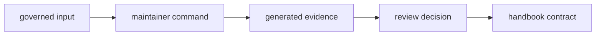

# Governed Input and Evidence Care

The reviewed files and evidence paths this crate touches are part of the
maintainer contract, not incidental implementation detail.

## Evidence Lifecycle

## Care Rules

| action | required care | failure mode |
| --- | --- | --- |
| change governed-input expectations | explain the repository policy that changed | command passes while policy meaning drifts |
| update audit or deny exceptions | keep owner, reason, link, and expiry reviewable | exception becomes permanent folklore |
| update benchmark evidence | separate current generated evidence from accepted baseline | transient performance data becomes a contract |
| add a new evidence output | document purpose, location, and review cost | generated files appear without ownership |
| add a new governed file | add command or test proof plus reader-facing docs | repository behavior depends on hidden config |

## Boundary Decisions

- This crate may validate reviewed files and write maintenance evidence.
- It should not quietly invent new repository control files or unmanaged output
  paths.
- Long-lived accepted evidence belongs in governed repository locations.
- Current-run evidence belongs under generated artifact locations.
- Product crates should not depend on maintainer-only evidence formats.

## First Proof Check

Inspect `crates/bijux-gnss-dev/docs/GOVERNANCE_FILES.md`,
`crates/bijux-gnss-dev/docs/OUTPUTS.md`,
`crates/bijux-gnss-dev/docs/BENCHMARKS.md`, and
`crates/bijux-gnss-dev/src/main.rs`.
