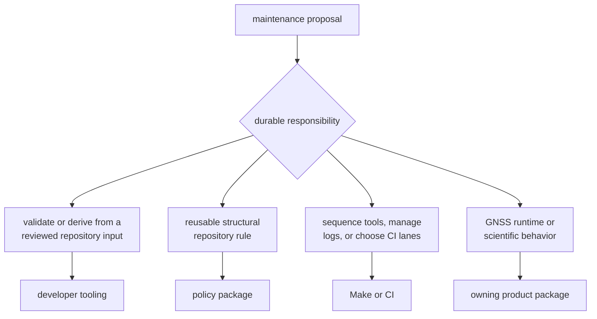
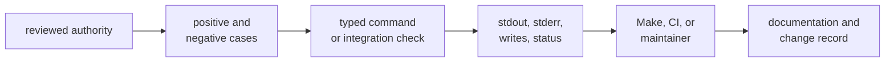

# Changing Maintainer Tooling

A maintainer command can change repository policy even when its implementation
diff is small. Work from the reviewed authority to the command, observable
effects, and first automation consumer. Do not begin by adding another
subcommand to the existing binary.

## Find the Owner

Developer tooling currently owns:

- validation of reviewed security exception records
- validation of local deny-policy deviation records
- deterministic derivation of audit ignore arguments
- invocation and comparison of a curated benchmark set
- integration proof that the slow-test ledger feeds fast and slow nextest
  expressions

It does not decide whether a security risk is acceptable, define shared
standards, own benchmark science, schedule the repository test lanes, or expose
operator behavior. The [maintainer ownership model](../foundation/ownership-boundary.md)
separates those authorities.

## Choose the Workflow

| Change | Primary guide | Required evidence |
| --- | --- | --- |
| command grammar or process behavior | [Maintainer interface contracts](../interfaces/) | parser behavior, exit status, output, and caller compatibility |
| security exception fields or expiry | [Audit policy](../../../crates/bijux-gnss-dev/docs/AUDIT_POLICY.md) | accepted and rejected controlled ledgers plus audit-workflow behavior |
| local deny deviation fields | [Governed repository inputs](../../../crates/bijux-gnss-dev/docs/GOVERNANCE_FILES.md) | accepted and rejected controlled ledgers plus upstream-link enforcement |
| audit ignore derivation | [Output contracts](../../../crates/bijux-gnss-dev/docs/OUTPUTS.md) | exact stdout, deterministic order, invalid input, and Make consumption |
| benchmark selection or comparison | [Benchmark evidence contract](../../../crates/bijux-gnss-dev/docs/BENCHMARKS.md) | parser/comparison tests and an environment-qualified benchmark run where justified |
| slow-test ledger | [Maintainer proof inventory](../../../crates/bijux-gnss-dev/docs/TESTS.md) | sorted uniqueness, source resolution, and fast/slow expression relationship |
| reusable guardrail | [Policy package guide](../../../crates/bijux-gnss-policies/README.md) | focused policy tests in the policy owner |

Use the [verification guide](verification-commands.md) for exact entry points
and limitations. Benchmark execution is expensive and environment-sensitive;
it is not a substitute for deterministic tests of normalization and threshold
logic.

## Change from Contract to Consumer

1. Name the policy authority and the repository file, process, or benchmark
   evidence that expresses it.
2. Define success, empty input, missing input, malformed input, stale records,
   external-process failure, and write failure as applicable.
3. Change one workflow family without coupling unrelated commands.
4. Test observable behavior with controlled inputs, not only the current
   repository state.
5. Exercise the first caller when stdout, status, quoting, writes, or ordering
   changes.
6. Update the command, governed-input, output, workflow, and test guides that
   describe the changed contract.
7. Record evidence and unresolved limitations without converting them into a
   passing claim.

The [contribution guide](contribution-guide.md) expands this into review and
commit expectations. The [governed-input care guide](governed-input-and-evidence-care.md)
applies when a reviewed ledger or persisted result changes.

## Treat Effects as Contracts

Read-only validators still affect automation through diagnostics and process
status. The ignore adapter’s stdout is parsed by Make. Benchmark comparison
creates directories, runs child processes, writes two classes of evidence, and
may or may not enforce a baseline.

For every command change, record:

- root-selection behavior
- files read and whether absence is success or failure
- exact machine-consumed output
- human diagnostics and error context
- files created, replaced, or appended
- child commands and environment assumptions
- strict and non-strict outcomes
- the caller that relies on each effect

Generated run evidence belongs in the repository artifact area. A long-lived
accepted baseline requires explicit version-control ownership, provenance, and
review policy; a generated current snapshot does not become a baseline by
being copied.

## Current Evidence Limits

The package has a package guardrail test and a detailed slow-lane integration
test. It has no dedicated command-level tests for the four subcommands. Direct
command execution therefore proves only behavior against the checked-in inputs,
not malformed fixtures or failure boundaries.

The benchmark command has no tracked baseline in the current checkout. It can
run benchmarks and write current evidence, but it cannot presently establish a
historical regression decision. Adding a baseline is a governance change, not
a convenient way to make comparison output appear complete.

These limits determine the next honest proof for a behavioral change. Do not
hide them behind a broad package or workspace pass.

## Reader Routes

- [Common maintainer workflows](common-workflows.md) summarizes current command
  families.
- [Local development](local-development.md) maps focused work by concern.
- [Change procedure](change-sequence.md) gives the compact edit order.
- [Review scope](review-scope.md) sets review depth by changed contract.
- [Release and versioning](release-and-versioning.md) explains why this private
  package is excluded from public publication.

Return to [maintainer interface contracts](../interfaces/) when the unresolved
question is compatibility rather than procedure, or to
[maintainer quality](../quality/) when the question is whether evidence can
support the claim.
