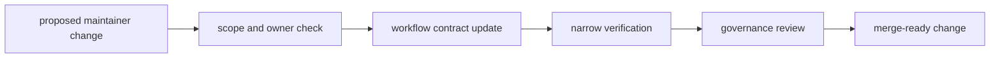

# Operations

Open this section when the question is how to change `bijux-gnss-dev` safely
without weakening repository governance or evidence discipline.

## Operational Model

## Read These First

- open [Change Sequence](change-sequence.md) first when the question is how to
  stage a safe maintainer-command change
- open [Verification Commands](verification-commands.md) when the question is
  what proof to run
- open [Governed Input And Evidence Care](governed-input-and-evidence-care.md)
  when a reviewed file or evidence location is touched
- open [Review Scope](review-scope.md) when a change spans both maintainer
  commands and a neighboring support or product crate

## Pages In This Section

- [Common Workflows](common-workflows.md)
- [Local Development](local-development.md)
- [Change Sequence](change-sequence.md)
- [Contribution Guide](contribution-guide.md)
- [Verification Commands](verification-commands.md)
- [Governed Input And Evidence Care](governed-input-and-evidence-care.md)
- [Review Scope](review-scope.md)
- [Release And Versioning](release-and-versioning.md)

## First Operational Surfaces

- `crates/bijux-gnss-dev/tests/`
- `crates/bijux-gnss-dev/docs/TESTS.md`
- `crates/bijux-gnss-dev/docs/WORKFLOWS.md`
- `crates/bijux-gnss-policies/`

## Leave This Section When

- leave for [Quality](../quality/) when the workflow is clear and the next
  question is whether the proof bar itself is strong enough
- leave for [Interfaces](../interfaces/) when the real issue is maintainer
  contract design rather than safe change procedure
- leave for [Foundation](../foundation/) when the operational question is
  actually a boundary dispute
