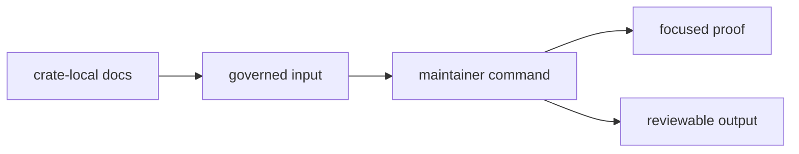

# Local Development

## Local Development Flow

## Working Habits

- read the matching crate-local docs before changing a command path
- identify the governed inputs and outputs before editing code
- trace the selected workflow from `Commands` to the specific `run_*` function
- keep edits grouped by one maintainer workflow instead of mixing unrelated
  governance surfaces

## Local Focus

This crate rewards narrow work. A small CLI or validation change can alter
repository policy behavior, so local development should stay precise even when
the code edit itself is short.

## Local Work Matrix

| change | inspect first | prove with |
| --- | --- | --- |
| audit allowlist validation | governed input docs and `audit-allowlist.toml` | allowlist command test or local command run |
| deny-policy deviation validation | deviation docs and TOML schema | deviation command test or local command run |
| benchmark comparison | benchmark docs and baseline file | benchmark comparison evidence or parser test |
| slow-test selection | roster and nextest expression script | suite-selection integration test |

## First Proof Check

Inspect `crates/bijux-gnss-dev/docs/ARCHITECTURE.md`,
`crates/bijux-gnss-dev/docs/WORKFLOWS.md`, and
`crates/bijux-gnss-dev/docs/TESTS.md` first. Then trace the target workflow in
`crates/bijux-gnss-dev/src/main.rs` so local work stays aligned with actual
repository-facing effects.

## Review Checks

- Which governed input or output changed?
- Does the proof cover the maintainer workflow, not only parsing?
- Is generated evidence written under a governed repository location?
