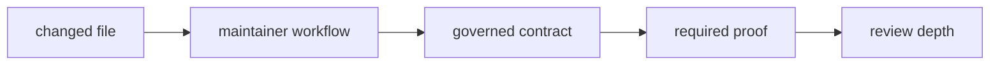

# Review Scope

Reviewers should align their depth to the changed maintainer workflow.

## Review Scope Flow

## Scope By Change Type

| change type | review focus |
| --- | --- |
| audit workflow | field requirements, expiry discipline, and derived-ignore behavior |
| deviation workflow | ownership, review-link, and expiry requirements |
| benchmark workflow | curated benchmark scope, evidence writing, normalization, and threshold comparison |
| repository guardrail test | whether the policy still belongs to maintainer governance |
| slow-test roster | real test resolution, sorted ledger, and fast/slow expression behavior |

## Review Shortcut

If the diff changes which repository file is read or where evidence is written,
treat the change as a boundary review even when the code diff looks small.

## First Proof Check

Use `crates/bijux-gnss-dev/docs/WORKFLOWS.md`,
`crates/bijux-gnss-dev/docs/GOVERNANCE_FILES.md`,
`crates/bijux-gnss-dev/docs/OUTPUTS.md`, and
`crates/bijux-gnss-dev/docs/TESTS.md` as the review map. Then inspect the
changed command path or integration test so review depth follows actual
maintainer risk rather than diff size.

## Review Checks

- Does the review name the repository contract at risk?
- Is the expected evidence path or failure message inspectable?
- Does the proof match the changed workflow family?
