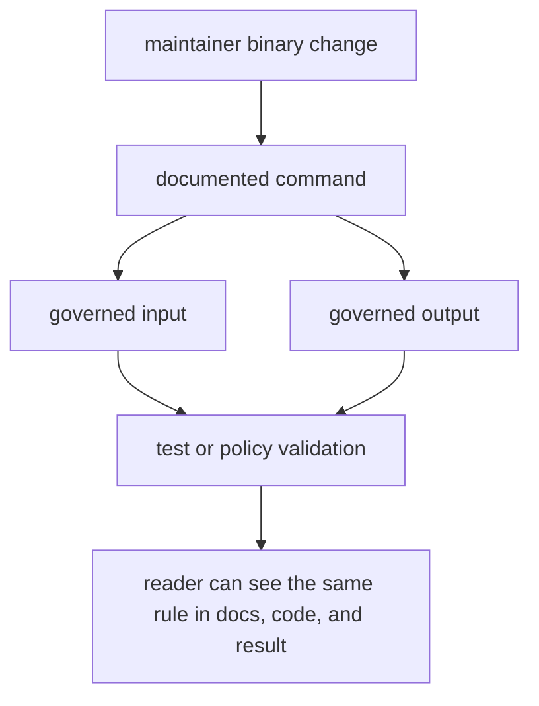

# Definition Of Done

A maintainer-binary change is done when the command contract, governed input,
governed output, and proof all describe the same repository-maintenance rule.
The binary can enforce reviewable mechanics; it cannot replace human judgment
or become a product API.

## Completion Gate

| changed surface | done means | proof to start from |
| --- | --- | --- |
| `audit-allowlist` | advisory exceptions remain explicit, attributable, linked, and time-bounded | command test plus `crates/bijux-gnss-dev/docs/AUDIT_POLICY.md` |
| `deny-policy-deviations` | local cargo-deny deviations still name owner, reason, review link, and expiry | command test plus `crates/bijux-gnss-dev/docs/GOVERNANCE_FILES.md` |
| `audit-ignore-args` | generated ignore flags come only from the reviewed allowlist | command behavior plus `crates/bijux-gnss-dev/docs/WORKFLOWS.md` |
| `bench-compare` | benchmark output, normalized snapshot, baseline comparison, and strict-mode behavior remain documented | `crates/bijux-gnss-dev/docs/BENCHMARKS.md` and output proof |
| command inventory | public command names and inputs match the binary and docs | `crates/bijux-gnss-dev/docs/COMMANDS.md` and guardrail tests |

## Proof Flow

## Reader Questions Before Commit

- Which documented command changed?
- Which governed input file or output path changed?
- Is the command still maintainer-only?
- Does the proof check the documented rule rather than only exercising code?
- If reusable behavior is needed, which product or policy crate should own it?

## Proof Route

1. Read `crates/bijux-gnss-dev/docs/BOUNDARY.md`.
2. Read `COMMANDS.md`, `WORKFLOWS.md`, and `OUTPUTS.md`.
3. Inspect `crates/bijux-gnss-dev/src/main.rs`.
4. Run the narrow check named in `crates/bijux-gnss-dev/docs/TESTS.md`.

Do not call a maintainer workflow done because it is convenient locally. It is
done only when the repository rule remains explicit, reviewable, and enforced by
the binary contract.
