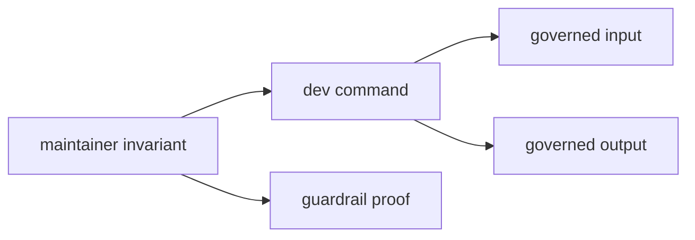

# Invariants

These expectations should remain true as the maintainer binary grows.

## Invariant Flow

## Boundary Invariants

- maintainer workflows stay separate from product behavior
- governed inputs remain explicitly named and documented
- maintenance evidence remains in governed repository locations

## Behavioral Invariants

- each command keeps a narrow reviewed maintainer purpose
- command failures explain the broken governance contract clearly
- benchmark comparison remains evidence-oriented rather than opaque automation
- the crate remains binary-only unless a stronger architectural reason appears

## Review Invariant

If a change moves command meaning, the matching docs and proof obligations
should move with it.

## Failure Signals

| signal | invariant at risk |
| --- | --- |
| command reads a new file with no governance docs | governed input visibility |
| output appears outside governed locations | evidence durability |
| roster entry no longer resolves to a real test | suite-selection integrity |
| benchmark comparison hides changed thresholds | reviewable performance evidence |

## Protecting Proof

- `crates/bijux-gnss-dev/docs/TESTS.md`
- `crates/bijux-gnss-dev/docs/WORKFLOWS.md`
- `crates/bijux-gnss-dev/tests/integration_guardrails.rs`
- `crates/bijux-gnss-dev/tests/integration_nextest_suite_selection.rs`

## Review Checks

- Which invariant would fail if this change were wrong?
- Does the command error tell a maintainer how to repair the governed input?
- Is the proof narrow enough to fail for the changed contract?
