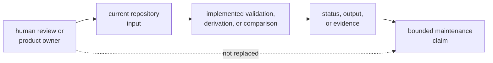
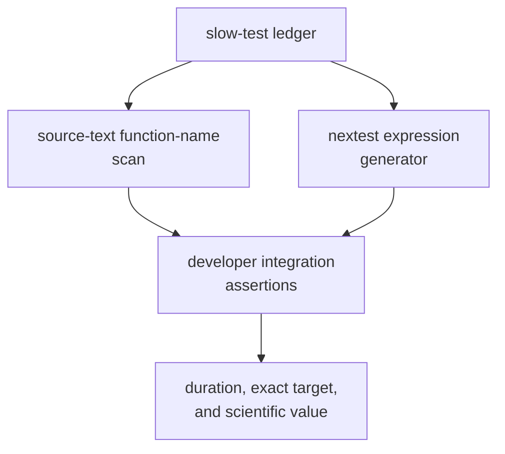

# Maintainer Tooling Limitations

`bijux-gnss-dev` provides four private maintenance commands and two
repository-integration test families. Its results are useful only when read at
that scope. A successful command does not approve an exception, establish
product health, prove complete schema validation, or certify benchmark
performance.

## Trust Boundary

The command proves only the implemented decision over the supplied input and
environment. Review authority remains outside the executable.

## Governance Validation Limits

| Limitation | Current behavior | Consequence | Honest response |
| --- | --- | --- | --- |
| syntax is not approval | security and deviation commands check required fields, simple formats, links, and expiry text | a structurally valid exception may still be unjustified or unsafe | review the underlying advisory or standards decision independently |
| dates are lexical | `YYYY-MM-DD` shape is checked and compared as text with the system date | impossible calendar values can satisfy shape checks | do not claim calendar validation; add typed date parsing before relying on it |
| current date is ambient | validators invoke the host `date` utility | missing utility, process failure, timezone, and host date affect execution | record environment and test clock failure when date behavior changes |
| links are superficial | HTTP(S) prefix is checked; deviation review text must contain `bijux-std` | existence, target identity, review status, and acceptance are not verified | inspect the review target and upstream state |
| schema is permissive | recognized arrays and fields are read from generic TOML values; unknown fields are not rejected | misspelled or obsolete fields can coexist with a pass | use controlled schema tests and define unknown-field policy |
| derivation accepts two shapes | ignore arguments come from reviewed advisory rows and a legacy ignore array | the validator checks only reviewed rows, while the adapter can emit legacy entries | run validation before derivation and retire or explicitly govern the legacy shape |
| invalid derived identifiers disappear | malformed identifiers are skipped by the adapter | mixed-validity input can produce plausible partial output | validate the source and add exact mixed-input tests |

The [audit policy](../../../crates/bijux-gnss-dev/docs/AUDIT_POLICY.md) describes
intended review discipline. The [maintainer evidence ledger](index.md)
distinguishes that intent from current automated proof.

## Root and Interface Limits

Every command resolves relative paths from `--workspace-root` or the process
current directory. There is no ancestor search, workspace marker check, or
canonical repository identity check.

This means:

- invocation from the wrong directory can report missing inputs or create
  evidence in an unintended tree
- an explicit path can point at a structurally similar but unrelated directory
- symlink and canonicalization behavior is not part of a documented identity
  policy
- the command does not record which root selection rule was used

Only the audit argument line is designed as machine-consumed stdout. Other
messages are human-facing prose. There is no JSON command result, typed
diagnostic envelope, or stable error-code catalog. Automation should rely on
documented process status and the exact adapter output, not parse incidental
wording.

Use [maintainer interface contracts](../interfaces/) for current command,
status, and output behavior.

## Test Coverage Limits

The package has no dedicated tests that invoke its four subcommands against
controlled workspaces. Direct command runs over checked-in records exercise
only the present happy input.

Unproved command behavior includes:

- alternate and incorrect roots
- absent, empty, malformed, duplicate, unknown, and mixed-validity records
- invalid calendar values and date-process failure
- exact stdout/stderr separation
- filesystem permission and partial-write failures
- benchmark subprocess failure and malformed output
- threshold edge cases, zero baselines, and non-finite ratios
- retry and replacement behavior

The package guardrail proves configured structural policy. The slow-lane
integration proves ledger and expression relationships. Neither proves command
behavior.

## Slow-Lane Policy Limits

The source scanner recognizes test attributes and function declarations
textually. A ledger entry is accepted when its full value or final `::` segment
matches any discovered test function name. It does not resolve Cargo package,
test target, module identity, macros, ignored state, or runtime duration.

The expression proof checks inclusion of every ledger entry and the fast/slow
negation relationship. It does not enumerate all tests selected by the regular
expression or establish that each rostered test deserves slow-lane placement.

The [suite-selection integration](../../../crates/bijux-gnss-dev/tests/integration_nextest_suite_selection.rs)
is therefore a policy-coherence check, not scientific or performance evidence.

## Benchmark Limits

The benchmark command is a repository convenience around a fixed set of
receiver and navigation targets. It is not a general benchmark framework.

| Limitation | Consequence |
| --- | --- |
| fixed target inventory | new product benchmarks receive no comparison until command code changes |
| legacy bencher-line parser | unrecognized Cargo output is omitted from the normalized snapshot |
| no tracked baseline | current runs skip historical comparison in this checkout |
| common-name comparison only | missing current benchmarks and newly appearing benchmarks receive no regression finding |
| environment sensitivity | machine load, compiler, power policy, and target state can dominate ratios |
| non-strict default | reported regressions do not fail unless strict mode is selected |
| direct replacement writes | a failure can leave raw output without a matching normalized snapshot |
| no command tests | parser, comparison, threshold, and write behavior are not independently pinned |

A successful run without a baseline means the selected benchmarks executed and
current evidence was written. It does not mean performance remained stable.
The [benchmark evidence guide](../../../crates/bijux-gnss-dev/docs/BENCHMARKS.md)
defines the intended review context, and the
[execution model](../architecture/execution-model.md) describes write ordering.

## Structural Limits

All command parsing, policy checks, external-process logic, normalization, and
comparison currently live in one binary source file. This keeps the package
small but weakens isolation and controlled testing as workflows grow.

The package is also intentionally:

- private and denied public release
- binary-only
- free of product package dependencies
- unsuitable as an API for product crates
- limited to repository-local effects

Do not solve the one-file constraint by publishing a library or introducing
generic utility modules. Split by admitted workflow ownership when review and
test isolation require it. The [extension model](../architecture/extensibility-model.md)
defines that threshold.

## Claims This Package Cannot Support

Do not use its output to claim:

- a security exception is acceptable
- a shared standards deviation was approved upstream
- the repository has no dependency or advisory risk
- a product crate is scientifically correct
- all slow tests are necessary, correctly classified, or executed
- receiver or navigation performance is stable without a governed comparison
- a benchmark set covers all important product paths
- public release readiness
- reproducibility outside the recorded command inputs and environment

## Record a Limitation

When behavior changes, document:

1. what the command directly observes
2. what decision it implements
3. what output or status a caller receives
4. which authority remains human or product-owned
5. which malformed, environmental, or failure cases are automated
6. which cases remain unproved
7. what evidence would remove the limitation

Use [maintainer change validation](change-validation.md) to turn a limitation
into focused proof. Do not remove a limitation from this page until the
implementation, automated evidence, caller contract, and remaining exposure
all agree.
