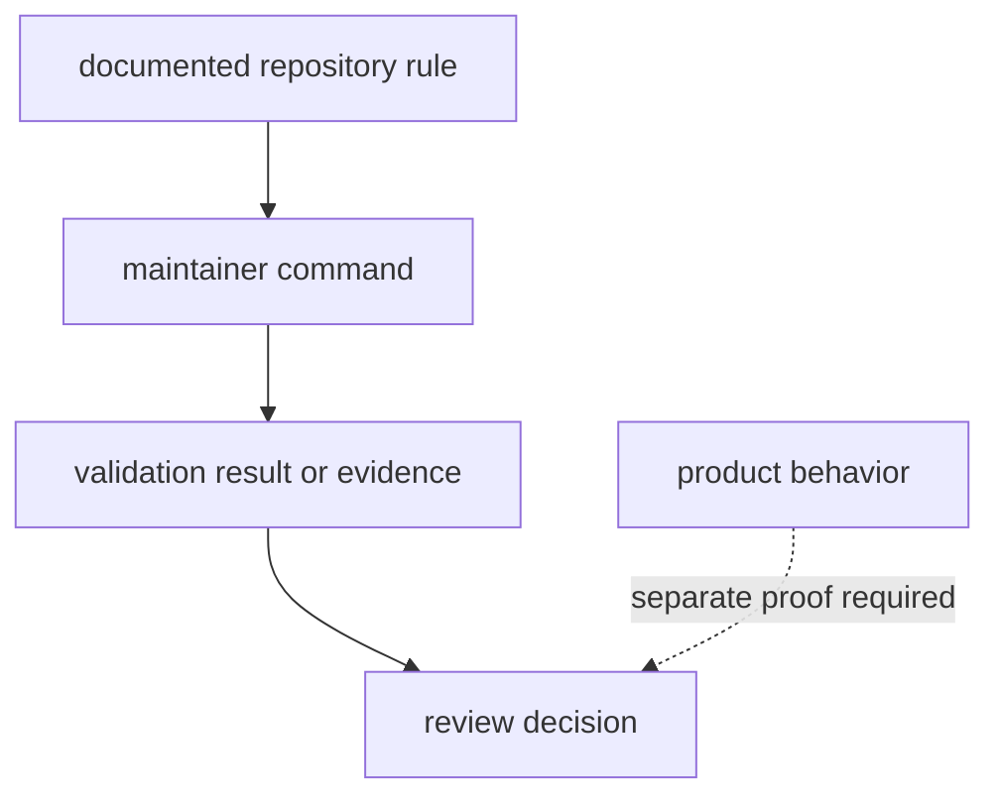

# Risk Register

This register is for maintainer-workflow trust risks, not general repository
concerns. A risk belongs here when `bijux-gnss-dev` can make a bad repository
state look validated, make evidence hard to audit, or blur the line between
maintenance automation and product behavior.

## Risk Register

| risk | failure mode | mitigation | first proof |
| --- | --- | --- | --- |
| automation sprawl | unrelated scripts collect in the binary because it is convenient | require every command to name a governed input, output, and maintainer owner | `COMMANDS.md`, `WORKFLOWS.md`, `BOUNDARY.md` |
| hidden policy | validation code enforces rules that docs do not name | update command, contract, workflow, and governed-file docs with the rule | `CONTRACTS.md`, `GOVERNANCE_FILES.md`, `AUDIT_POLICY.md` |
| unmanaged evidence | benchmark or validation output lands outside governed paths | route run evidence to `artifacts/` and durable baselines to `benchmarks/` | `OUTPUTS.md`, `BENCHMARKS.md` |
| overclaimed success | a passing maintainer command is treated as product health | state the exact command scope and require product-owner proof for product claims | `TESTS.md` plus owning product docs |
| unreadable binary growth | one-file command implementation hides workflow boundaries | split by stable workflow ownership when command families become hard to review | `ARCHITECTURE.md` and `src/main.rs` review |

## Evidence Flow

## Review Standard

- Keep the refusal ledger current when a useful workflow does not belong here.
- Review every new read and write as a boundary change.
- Require docs updates when governed inputs, outputs, or validation rules
  change.
- State verification scope honestly when benchmark execution is skipped.
- Do not let command success stand in for product, security, or release proof
  that belongs to another owner.

Inspect `crates/bijux-gnss-dev/docs/BOUNDARY.md`, `WORKFLOWS.md`,
`OUTPUTS.md`, `TESTS.md`, and `crates/bijux-gnss-dev/src/main.rs` when this
register changes. The risk register is only useful if it matches the real
binary shape and the real evidence locations.
