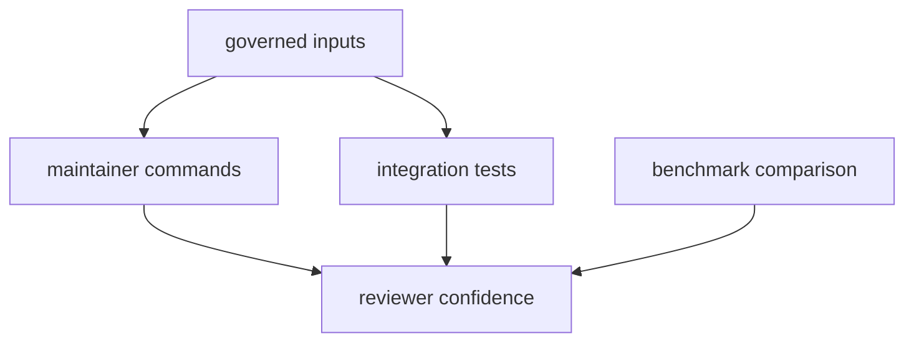

# Test Strategy

`bijux-gnss-dev` needs layered proof because it governs repository behavior
rather than one isolated algorithm.

## Proof Route

## Main Proof Layers

| layer | protects | first command or test |
| --- | --- | --- |
| command execution | command-line behavior over governed inputs | `audit-allowlist`, `deny-policy-deviations`, `audit-ignore-args` |
| repository guardrails | crate scope, paths, and workflow boundaries | `integration_guardrails.rs` |
| suite selection | slow-test roster integrity and nextest selection behavior | `integration_nextest_suite_selection.rs` |
| governed-input consistency | documented files match command and test expectations | docs plus source review |
| benchmark comparison | baseline extraction and regression reporting | `bench-compare` |

## Layer Discipline

- A passing command does not prove the repository boundary is still sound.
- A passing guardrail test does not prove a governed-file workflow still means
  the same thing.
- A benchmark comparison can report insufficient evidence when a full benchmark
  run is too expensive for the current documentation pass.
- New governed files need both command or test proof and reader-facing docs.
- Failures should name the repository contract that was violated, not just the
  file path that failed parsing.

## First Proof Check

Inspect `crates/bijux-gnss-dev/docs/TESTS.md`,
`crates/bijux-gnss-dev/tests/integration_guardrails.rs`,
`crates/bijux-gnss-dev/tests/integration_nextest_suite_selection.rs`,
`crates/bijux-gnss-dev/docs/GOVERNANCE_FILES.md`, and
`crates/bijux-gnss-dev/docs/BENCHMARKS.md`.
