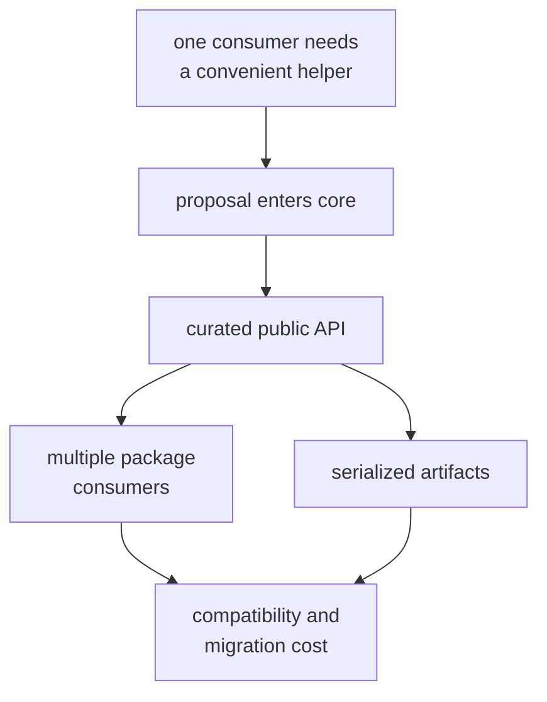
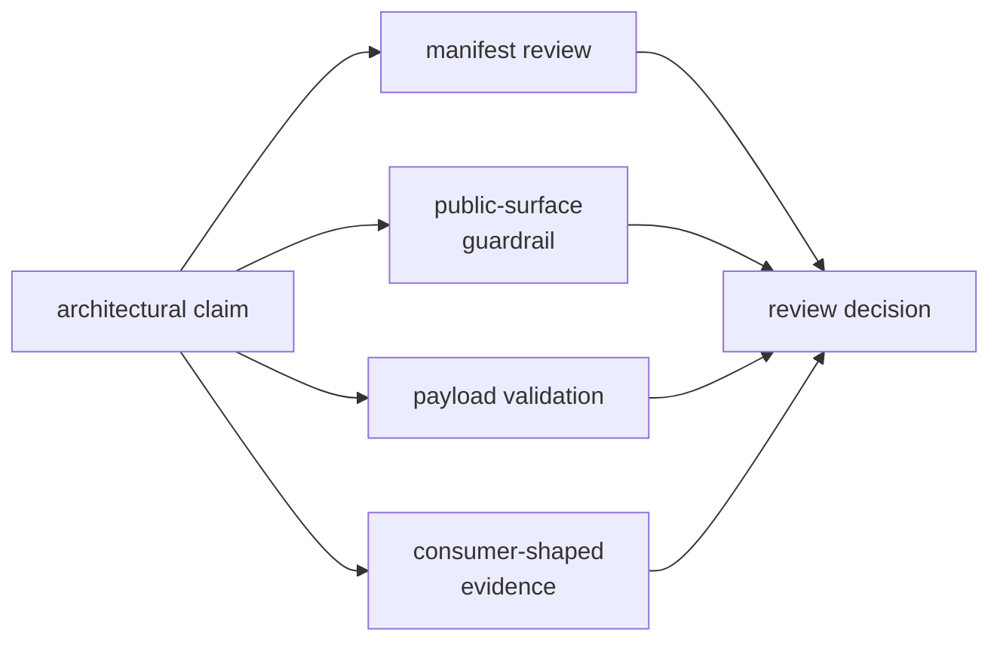

# Core Architecture Risks

Core is easy to depend on and expensive to correct after a weak contract
spreads. Its main architectural risk is not implementation complexity; it is
admitting meaning that belongs to one runtime, storage system, or scientific
method and then making every consumer carry that assumption.

## Where Pressure Enters

The earlier a proposal is challenged, the cheaper it is to place correctly.
Once a type is public or persisted, moving it is no longer only code
organization.

## Risk Register

| Risk | Warning sign | Consequence | Control |
| --- | --- | --- | --- |
| Contract sprawl | A type is described as “shared” but has one real producer and consumer. | Core becomes a catalog of incidental records with unclear owners. | Apply the [public admission rules](../interfaces/api-surface.md) and prefer the stronger downstream owner. |
| Runtime policy leakage | A record carries retry, scheduling, filesystem, terminal, or process decisions. | Shared data can no longer be interpreted outside one workflow. | Keep effects at the [integration seams](integration-seams.md). |
| Scientific policy leakage | A common record embeds estimator thresholds, lock policy, or correction choices. | Consumers inherit one algorithm’s judgment as if it were domain truth. | Keep results and evidence in core; keep decisions in the scientific owner. |
| Public-surface creep | An implementation helper is exported because direct access is convenient. | Private organization becomes an accidental compatibility promise. | Route deliberate contracts through the curated API and add consumer-shaped proof. |
| Serialization drift | Fields, defaults, units, or invalid states change without reader policy. | Old artifacts may be silently reinterpreted or refused unpredictably. | Follow [state and serialization](state-and-serialization.md) and test old and invalid records. |
| Dependency reversal | Core imports a higher package to reuse behavior. | Runtime, persistence, or solver assumptions enter the common vocabulary. | Enforce the [dependency direction](dependency-direction.md) in the production manifest. |
| Duplicate meaning | Two records model the same concept with different names, units, or validity. | Adapters become lossy and callers cannot identify the canonical contract. | Extend the owning family or document why the concepts are genuinely distinct. |

## Guardrails Are Narrow Evidence

No single existing check proves core is architecturally sound:

- The [public-surface guardrail](https://github.com/bijux/bijux-gnss/blob/main/crates/bijux-gnss-core/tests/public_api_guardrail.rs)
  scans source text for public structs and free functions. It does not cover
  enums, traits, constants, aliases, methods, or semantic compatibility.
- The [package guardrail](https://github.com/bijux/bijux-gnss/blob/main/crates/bijux-gnss-core/tests/integration_guardrails.rs)
  applies shared source and API policy. It does not prove unit meaning,
  serialization compatibility, or correct ownership.
- Navigation and tracking artifact tests exercise selected invalid records.
  They do not cover every payload family or historical reader.
- The production manifest currently has no dependency on another GNSS package,
  but that fact must be reviewed whenever dependencies change.

Tests are evidence for specific controls, not substitutes for architecture
review.

## Review the Blast Radius

Before accepting a core change, answer:

1. Which packages need exactly the same meaning?
2. Can the type be understood without one package’s runtime or storage policy?
3. Are units, frames, time systems, validity, refusal, and ordering explicit?
4. Is the contract public, serialized, or both?
5. Which existing readers could reinterpret the change?
6. Which guardrail is relevant, and what does it leave unproved?
7. Would a downstream owner make later change safer?

Record a limitation when evidence is representative rather than exhaustive.
Do not describe a green guardrail as proof of semantic compatibility.

The architecture remains healthy when additions sharpen shared vocabulary,
effects stay outside core, production dependencies point inward, and every
public or persisted contract has a named compatibility argument.
