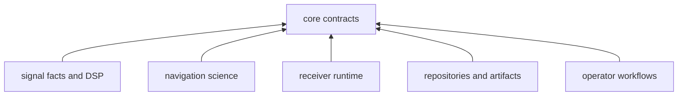
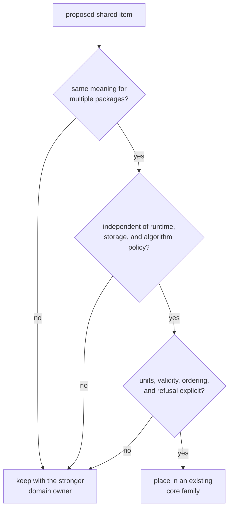

# Dependency Direction

Core is the common vocabulary beneath the GNSS packages. Production code in
signal, navigation, receiver, infrastructure, and command may consume it.
Core production code must not consume those packages, because doing so would
attach shared meaning to one algorithm, runtime, repository, or user
interface.

## Allowed Production Graph

The [production manifest](https://github.com/bijux/bijux-gnss/blob/main/crates/bijux-gnss-core/Cargo.toml) currently
depends only on general-purpose libraries for errors, complex numbers, and
serialization. Its development dependencies may include repository policy
tooling used to test the package; development tooling is not part of the
production contract graph.

## Distinguish Reuse from Ownership

Duplication is not, by itself, a reason to move code into core. First identify
what is shared.

| Proposal | Correct direction |
| --- | --- |
| A stable identity, unit, time value, diagnostic, or exchanged record | consider admission to a core contract family |
| Receiver scheduling, channel lifecycle, or retry behavior | keep in receiver |
| Estimator, correction, integrity, or solution policy | keep in navigation |
| Signal generation, modulation, raw-sample, or reusable DSP behavior | keep in signal |
| Repository layout, dataset discovery, manifests, or history | keep in infrastructure |
| Argument parsing, command selection, rendering, or exit policy | keep in command |
| A test helper used by several packages | place with test tooling unless production semantics are genuinely shared |

Core may define the record exchanged at a boundary without owning either side’s
behavior. For example, it can define a navigation result while navigation owns
the estimator and receiver owns the handoff.

## Admission Test

If a proposal passes this test, follow the
[extensibility model](extensibility-model.md) and
[API contract](../interfaces/api-surface.md). A new production dependency still
requires separate review: a sound type placement does not automatically
justify another library edge.

## Detect a Reversed Edge

Treat these as architecture failures:

- a core function needs a receiver configuration or runtime handle
- a shared record can be interpreted only with repository path conventions
- a core validator invokes navigation or signal algorithms
- an error or diagnostic contains command-specific recovery instructions
- a feature flag exists only to make core aware of a higher package
- a convenience adapter imports a downstream type instead of living beside
  that downstream consumer

Move behavior outward and leave only the stable exchanged meaning in core.
When two downstream packages need adapters, prefer adapters at each boundary
over teaching core both owners’ policies.

## Evidence and Its Limit

Review the production and development sections of the manifest separately.
The [crate architecture](https://github.com/bijux/bijux-gnss/blob/main/crates/bijux-gnss-core/docs/ARCHITECTURE.md)
documents the intended graph, and the
[package guardrail](https://github.com/bijux/bijux-gnss/blob/main/crates/bijux-gnss-core/tests/integration_guardrails.rs)
checks shared repository policy. The guardrail is not a complete dependency
architecture proof; manifest review and downstream impact review remain
necessary.

A dependency change is ready when the edge has a stable semantic reason,
production remains independent of higher GNSS packages, public contracts do
not absorb consumer policy, and the review states what automation does and
does not enforce.
