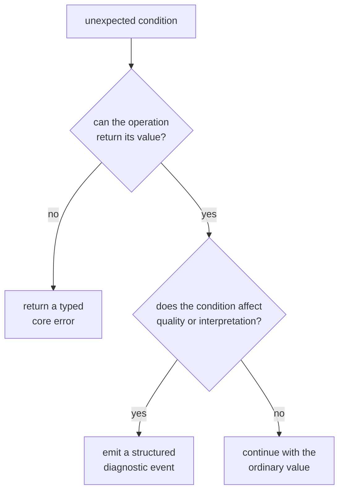
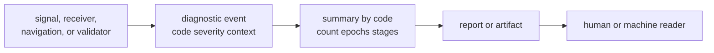

# Failures, Diagnostics, and Validation

Core has three ways to describe something wrong: a typed error stops an
operation, a diagnostic records structured evidence, and validation returns
diagnostics about an otherwise readable value. They are related, but they are
not interchangeable.

## Choose the Contract by Reader Need

| Situation | Core contract | Reader expectation |
| --- | --- | --- |
| An operation cannot produce a value | typed error category | branch on the Rust type; display the message as context |
| A stage completed with information, degradation, or failure evidence | diagnostic event | inspect severity, stable code, message, and context |
| A collection of events needs a compact report | diagnostic summary | inspect counts, epoch range, and contributing stages by code |
| A decoded artifact may violate cross-field rules | payload validation | retain the value only according to the caller’s read policy and returned diagnostics |
| A user needs recovery instructions | owning runtime or command layer | add operational context outside core rather than embedding workflow policy here |

The [error taxonomy](https://github.com/bijux/bijux-gnss/blob/main/crates/bijux-gnss-core/src/error.rs) currently
defines separate Rust types for input, configuration, I/O, parsing, signal,
acquisition, tracking, navigation, and invariant failures. Each type contains
only a human-readable message. The category is conveyed by the Rust type, not
by a machine-readable field inside the value.

## Diagnostics Carry Durable Evidence

A [diagnostic event](https://github.com/bijux/bijux-gnss/blob/main/crates/bijux-gnss-core/src/diagnostic/mod.rs)
contains severity, code, message, and key-value context. Aggregation groups
events by code and preserves counts, epoch bounds, and contributing stages.
The [diagnostic catalog](https://github.com/bijux/bijux-gnss/blob/main/crates/bijux-gnss-core/src/diagnostic/codes.rs)
provides known code meanings and mitigations.

Use the [diagnostic contract guide](https://github.com/bijux/bijux-gnss/blob/main/crates/bijux-gnss-core/docs/DIAGNOSTICS.md)
before adding or changing a code. A message may explain the instance, but
consumers should not parse prose to recover identity or severity. Information
needed for filtering, aggregation, or remediation belongs in the code catalog
or structured context.

## Mapping Rules

- Preserve the most specific error category available when crossing a package
  boundary. Do not collapse parsing, input, and invariant failures into one
  generic message before the caller can decide what to do.
- Add runtime details while mapping outward, not inward. Paths, retry policy,
  command wording, and operator advice belong to the layer that owns them.
- Do not turn a diagnostic warning into success without evidence. The caller
  must decide whether its read or execution policy permits degraded output.
- Do not use diagnostics as an exception mechanism when no value can be
  produced. Return an error and emit separate evidence only when both are
  useful.
- Treat code, severity, and context meaning as compatibility-sensitive when
  diagnostics are serialized or consumed across packages.

## Current Limits

Typed core errors do not currently expose structured reason codes, source
chains, affected fields, or serialization. Their message text is therefore
useful to humans but is not a stable machine interface. Diagnostic context is a
list of string pairs rather than a typed schema, so each producer must document
the keys a reader may rely on.

The public API includes the error categories and diagnostic records, but the
[surface guardrail](https://github.com/bijux/bijux-gnss/blob/main/crates/bijux-gnss-core/tests/public_api_guardrail.rs)
does not prove their semantic stability. Artifact validation tests demonstrate
selected diagnostic behavior, not exhaustive coverage of every code or
payload.

A failure-contract change is reviewable when the stopping behavior, category,
machine-readable evidence, caller policy, serialized impact, and remaining
limit are all explicit.
