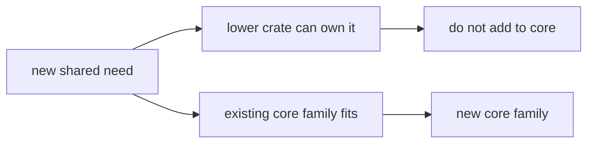

# Extensibility Model

`bijux-gnss-core` should extend by deepening existing contract families more
often than by creating new ones.

Core extensions are expensive because they define shared vocabulary. Before
adding a new public family, prove that at least two owners need the same
meaning and that no lower crate can own it honestly.

## Preferred Extension Paths

- extend `src/observation/` when a new shared measurement record is genuinely
  needed
- extend `src/artifact/` with explicit version boundaries rather than rewriting
  existing payload meaning
- extend `src/api.rs` only after the shared contract need is proven
- extend docs, invariants, and protecting tests in the same change set

## Extension Smells

- new top-level module for one small helper
- public export added before two downstream crates actually need it
- runtime or persistence assumptions embedded in a supposedly generic record
- convenience conversion that hides unit, time-system, or coordinate-system
  meaning
- serialized field added without a reader-visible compatibility story

## Decision Table

| proposed extension | right first question |
| --- | --- |
| new observation record | Which producers and consumers exchange it as shared meaning? |
| new artifact payload | Which persisted readers need to survive producer changes? |
| new diagnostic code | Which crate emits it and which crate interprets it? |
| new unit or time helper | What existing convention proves the conversion boundary? |
| new public export | Why is it not local to the consuming crate? |

## Proof Path

Start with the [core change rules](https://github.com/bijux/bijux-gnss/blob/main/crates/bijux-gnss-core/docs/CHANGE_RULES.md)
and the public API guardrail test. If the extension affects serialization,
also read the [serialization guide](https://github.com/bijux/bijux-gnss/blob/main/crates/bijux-gnss-core/docs/SERIALIZATION.md)
before accepting the shape.
