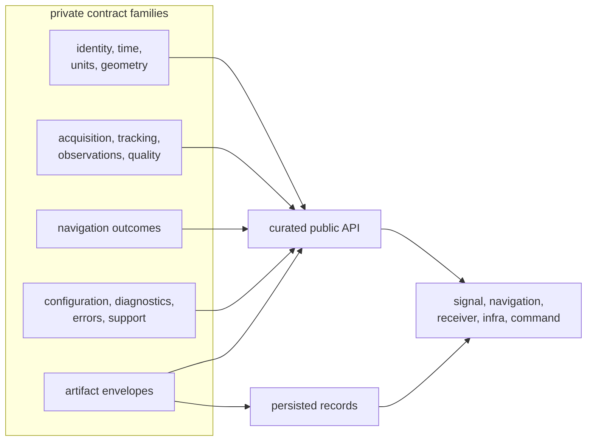
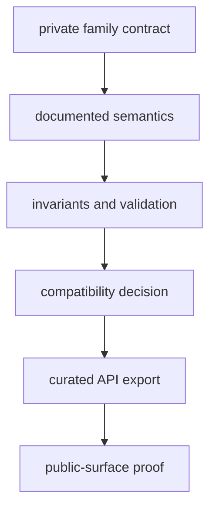
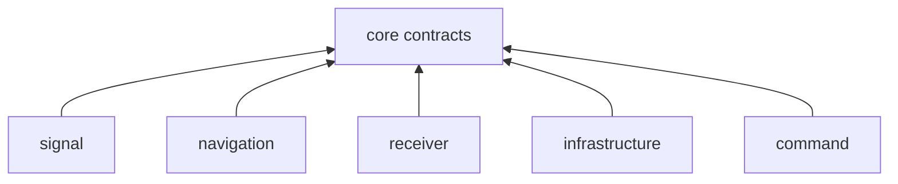

# Core Contract Architecture

Core is a contract library, not a pipeline. Private modules own coherent
semantic families; one curated API publishes the contracts downstream packages
may rely on. Versioned artifact wrappers carry selected records across process
and release boundaries without giving core responsibility for repository
layout.

## Structural Model

Private does not mean unstable or unimportant. It means callers depend on
contract meaning through the curated surface rather than coupling themselves to
the crate’s current file organization.

## Architectural Decisions

| decision | governing document |
| --- | --- |
| Find the family that owns a shared meaning | [Module map](module-map.md) |
| Check whether a dependency points inward | [Dependency direction](dependency-direction.md) |
| Follow a public contract to its implementation | [Code navigation](code-navigation.md) |
| Change a record that survives serialization | [State and serialization](state-and-serialization.md) |
| Understand where another package takes ownership | [Integration seams](integration-seams.md) |
| Choose a shared failure category | [Error model](error-model.md) |
| Add a family or public export | [Extensibility model](extensibility-model.md) |
| Review structural failure modes | [Architecture risks](architecture-risks.md) |

## Public Admission

An export is a compatibility commitment, not a convenience shortcut. Public
admission requires stable meaning, a named owner, explicit invalid states, and
evidence that downstream callers can use the contract without private-module
access. Persisted contracts additionally require version and reader behavior.

## Dependency Rule

All GNSS product packages may consume core. Core production code must not
consume those packages. Reversing that direction would import algorithm,
runtime, storage, or operator assumptions into the shared vocabulary and make
otherwise independent consumers depend on them.

## State And Effects

Core values are predominantly data and pure transformations. Runtime schedulers,
mutable tracking loops, estimator workspaces, file handles, run directories,
and terminal rendering remain outside. Core can define an artifact header and
validate its payload; infrastructure decides its location, and the scientific
producer explains why the payload exists.

That separation lets a future reader validate record meaning without
reconstructing the original command process.

## Evidence Routes

The [crate architecture](https://github.com/bijux/bijux-gnss/blob/main/crates/bijux-gnss-core/docs/ARCHITECTURE.md)
states the production boundary. The
[curated API](https://github.com/bijux/bijux-gnss/blob/main/crates/bijux-gnss-core/src/api.rs) is the supported
import surface. [Public API guardrails](https://github.com/bijux/bijux-gnss/blob/main/crates/bijux-gnss-core/tests/public_api_guardrail.rs)
protect that surface, while
[package-boundary guardrails](https://github.com/bijux/bijux-gnss/blob/main/crates/bijux-gnss-core/tests/integration_guardrails.rs)
protect dependency shape.

For persisted meaning, use
[navigation artifact validation](https://github.com/bijux/bijux-gnss/blob/main/crates/bijux-gnss-core/tests/nav_artifact_validation.rs),
[tracking artifact validation](https://github.com/bijux/bijux-gnss/blob/main/crates/bijux-gnss-core/tests/tracking_artifact_validation.rs),
and [timekeeping properties](https://github.com/bijux/bijux-gnss/blob/main/crates/bijux-gnss-core/tests/prop_timekeeping.rs)
as concrete proof routes rather than inferring behavior from type names.
