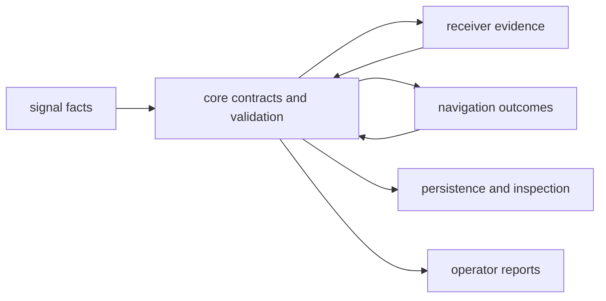

# Integration Seams

Core integration seams are typed agreements between producers and consumers.
They prevent one crate's runtime assumptions from becoming another crate's
implicit data model.

## Contract Exchange

Core may define a record used in both directions, but it does not schedule the
producer or decide how a consumer presents the result.

## Main Seams

| seam | producer obligation | consumer obligation |
| --- | --- | --- |
| [curated public API](https://github.com/bijux/bijux-gnss/blob/main/crates/bijux-gnss-core/src/api.rs) | expose only contracts with durable cross-crate meaning | import supported exports instead of private modules |
| [identity, unit, coordinate, and time contracts](https://github.com/bijux/bijux-gnss/blob/main/crates/bijux-gnss-core/docs/CONTRACTS.md) | attach explicit physical and temporal meaning | do not reinterpret values using local defaults |
| [observation contracts](https://github.com/bijux/bijux-gnss/blob/main/crates/bijux-gnss-core/src/observation.rs) | preserve assumptions, uncertainty, quality, and refusal evidence | distinguish measurement evidence from navigation interpretation |
| [navigation result contracts](https://github.com/bijux/bijux-gnss/blob/main/crates/bijux-gnss-core/src/nav_solution.rs) | report residual, validity, lifecycle, and refusal meaning | avoid inferring solver internals not present in the contract |
| [artifact contracts](https://github.com/bijux/bijux-gnss/blob/main/crates/bijux-gnss-core/src/artifact.rs) | select the correct kind and payload version and pass semantic validation | enforce read policy before trusting persisted state |
| [diagnostic contracts](https://github.com/bijux/bijux-gnss/blob/main/crates/bijux-gnss-core/src/diagnostic/mod.rs) | emit stable codes, severity, context, and owning stage | aggregate or render without changing diagnostic meaning |
| [support inventory](https://github.com/bijux/bijux-gnss/blob/main/crates/bijux-gnss-core/src/support_matrix.rs) | state capability and refusal status accurately | avoid treating declared support as proof of runtime success |

## Admission Test

A new seam belongs in core only when:

1. More than one package exchanges the same durable meaning.
2. Units, identity, time, frame, validity, and serialization can be defined
   without one runtime implementation.
3. Both producers and consumers can validate their side of the agreement.
4. A stronger owner cannot keep the state local without duplication or semantic
   drift.

Convenience alone is not enough. Similar structs in two crates may represent
different lifecycle states and should remain separate until their semantics are
identical.

## Change Impact

Changing one side of a seam requires review of every producer, consumer,
persisted representation, and diagnostic that carries the affected meaning.
Use the [contract map](https://github.com/bijux/bijux-gnss/blob/main/crates/bijux-gnss-core/docs/CONTRACT_MAP.md) to
identify ownership and the
[release guide](../operations/release-and-versioning.md) to classify
compatibility.
