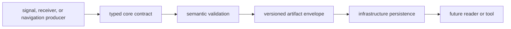

# State and Serialization

`bijux-gnss-core` carries little mutable runtime state. Its lasting state is the
meaning of records exchanged between crates and stored for later inspection.
Serialization is therefore a scientific contract, not just a transport detail.

## From Runtime State to Durable Meaning

A Rust value becomes trustworthy persisted evidence only after its contract
validator has checked scientific coherence. Parsing a valid shape is not enough.

## State Families

| state family | durable meaning | owner |
| --- | --- | --- |
| identities, units, coordinates, and time | constellation, signal, frame, scale, epoch, and physical quantity interpretation | [foundational contracts](https://github.com/bijux/bijux-gnss/blob/main/crates/bijux-gnss-core/docs/CONTRACTS.md) |
| acquisition, tracking, and observations | receiver decisions, assumptions, uncertainty, quality, and measurement context | [observation contracts](https://github.com/bijux/bijux-gnss/blob/main/crates/bijux-gnss-core/src/observation.rs) |
| navigation outcomes | solutions, residuals, validity, lifecycle, refusal, and inter-system bias | [navigation result contracts](https://github.com/bijux/bijux-gnss/blob/main/crates/bijux-gnss-core/src/nav_solution.rs) |
| diagnostics and configuration | stable failure categories, severity, context, schema versions, and validation reports | [diagnostic contracts](https://github.com/bijux/bijux-gnss/blob/main/crates/bijux-gnss-core/src/diagnostic/mod.rs) and [configuration contracts](https://github.com/bijux/bijux-gnss/blob/main/crates/bijux-gnss-core/src/config.rs) |
| artifacts | payload kind, envelope metadata, read policy, version, and semantic validation | [artifact contracts](https://github.com/bijux/bijux-gnss/blob/main/crates/bijux-gnss-core/src/artifact.rs) |

Runtime schedulers, loop state, estimator workspaces, file handles, and command
presentation remain outside core even when they produce one of these records.

## Serialization Rules

- Preserve units, frames, time systems, identity, validity, and provenance in
  the record or its enclosing artifact.
- Reject non-finite or internally inconsistent values when the contract can
  determine they are invalid.
- Add an explicit payload version when old and new readers cannot assign the
  same meaning to the same bytes.
- Keep validation beside the contract family instead of relying on one command
  to reject bad state.
- Treat fixture changes as contract changes; explain why expected meaning moved
  instead of regenerating bytes from the implementation under test.

The [serialization guide](https://github.com/bijux/bijux-gnss/blob/main/crates/bijux-gnss-core/docs/SERIALIZATION.md)
defines the crate-wide rules for artifact envelopes, payload versions, and
fixtures.

## Persistence Boundary

Core owns record meaning and validation. Infrastructure owns deterministic
locations, manifests, reports, history, and byte persistence. The command
facade owns operator selection and presentation. Neither layer may reinterpret
a core field to make an artifact appear valid.

## Evidence

- [Navigation artifact validation](https://github.com/bijux/bijux-gnss/blob/main/crates/bijux-gnss-core/tests/nav_artifact_validation.rs)
  checks model versions, satellite counts, finite values, covariance, and clock
  units.
- [Tracking artifact validation](https://github.com/bijux/bijux-gnss/blob/main/crates/bijux-gnss-core/tests/tracking_artifact_validation.rs)
  checks tracking payload coherence.
- [Timekeeping properties](https://github.com/bijux/bijux-gnss/blob/main/crates/bijux-gnss-core/tests/prop_timekeeping.rs)
  protect time conversion behavior across generated cases and retained
  regressions.
- [Public API guardrails](https://github.com/bijux/bijux-gnss/blob/main/crates/bijux-gnss-core/tests/public_api_guardrail.rs)
  keep supported imports independent of private layout.
