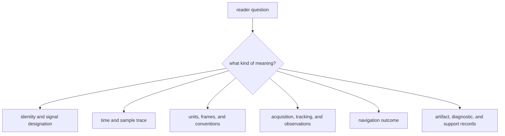
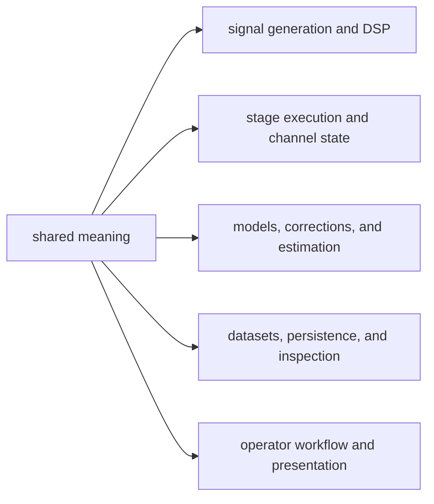

# Shared GNSS Vocabulary

Use this page when a term appears in more than one package and you need to know
which meaning is shared. Core owns the vocabulary exchanged between packages;
it does not own every algorithm or workflow that uses those words.

## Find The Meaning You Need

| reader question | shared vocabulary | continue with |
| --- | --- | --- |
| Which constellation, satellite, signal, band, code, component, slot, or GLONASS channel is this? | `Constellation`, `SatId`, `SigId`, `SignalBand`, `SignalCode`, component specifications, and frequency-channel types | [Identity contracts](https://github.com/bijux/bijux-gnss/blob/main/crates/bijux-gnss-core/src/ids.rs) |
| When did this value occur, and is the timestamp based on GPS, UTC, TAI, an epoch, or a receiver sample? | `GpsTime`, `UtcTime`, `TaiTime`, `Epoch`, `SampleClock`, and `ReceiverSampleTrace` | [Time contracts](https://github.com/bijux/bijux-gnss/blob/main/crates/bijux-gnss-core/src/time.rs) |
| What physical quantity, sign, or coordinate frame does this number use? | meters, seconds, hertz, chips, cycles, WGS-84, ECEF, ENU, and LLH | [Unit contracts](https://github.com/bijux/bijux-gnss/blob/main/crates/bijux-gnss-core/src/units.rs), [coordinate contracts](https://github.com/bijux/bijux-gnss/blob/main/crates/bijux-gnss-core/src/geo.rs), and [engineering conventions](../interfaces/engineering-conventions.md) |
| What evidence crossed the acquisition, tracking, or observation boundary? | requests, hypotheses, results, tracking epochs, transitions, observation epochs, uncertainty, quality, and differencing records | [Observation and tracking contracts](../interfaces/observation-and-tracking-contracts.md) |
| What did navigation produce without exposing solver internals? | solution status, validity, lifecycle, residuals, inter-system bias, uncertainty, refusal, and position fields | [Navigation result contracts](../interfaces/navigation-solution-contracts.md) |
| How is evidence versioned, diagnosed, validated, or declared supported? | artifact envelopes, payload kinds, diagnostic events, validation reports, and support rows | [Artifact contracts](../interfaces/artifact-contracts.md) and [configuration and diagnostics](../interfaces/configuration-and-diagnostics.md) |

The [contract map](https://github.com/bijux/bijux-gnss/blob/main/crates/bijux-gnss-core/docs/CONTRACT_MAP.md) is the
complete ownership index. Source links identify where meaning is defined; public
consumers import supported items through `bijux_gnss_core::api`.

## Similar Words That Are Not Interchangeable

### PRN, Satellite, Signal, And Channel

A PRN number alone is not a globally unique satellite identity. `SatId`
combines constellation and PRN. `SigId` adds band and code. GLONASS L1 FDMA also
needs a frequency channel. Preserve the most specific identity available when
records cross package or artifact boundaries.

### Epoch, Receiver Time, And Transmit Time

An epoch index orders processing but does not establish physical time.
`ReceiverSampleTrace` ties receiver time to sample index and sample rate.
Transmit time describes the signal path and must not be substituted for receive
time. State the time system whenever a plain scalar could be ambiguous.

### Carrier Frequency, Doppler, And Carrier Phase

Hertz can describe an absolute carrier, an intermediate-frequency-relative
carrier estimate, or Doppler. Cycles describe phase, not frequency. A field
needs a name and convention that distinguishes these meanings; sharing a unit
does not make them equivalent.

### Status, Validity, Lifecycle, And Refusal

Status describes the classified outcome, validity says whether consumers may
use it under the contract, lifecycle locates it in processing history, and
refusal explains why a usable result was not produced. Do not collapse these
records into one boolean.

### Artifact Validity And Scientific Accuracy

Artifact validation proves schema and cross-field coherence. It does not prove
that acquisition locked the correct peak, tracking remained physically
accurate, or navigation converged to truth. Those claims remain with the
receiver or navigation evidence.

## Leave Core At The Behavior Boundary

- For code generation, sampling, spectra, replicas, or loop mathematics, follow
  the [signal handbook](../../bijux-gnss-signal/index.md).
- For acquisition decisions, tracking lifecycle, observation construction, or
  runtime artifacts, follow the
  [receiver handbook](../../bijux-gnss-receiver/index.md).
- For orbit products, corrections, position estimation, PPP, RTK, or integrity,
  follow the [navigation handbook](../../bijux-gnss-nav/index.md).
- For registry interpretation, run layout, persistence, or artifact inspection,
  follow the [infrastructure handbook](../../bijux-gnss-infra/index.md).
- For command behavior and rendered output, follow the
  [operator handbook](../../bijux-gnss/index.md).

## Adding Shared Language

A proposed term belongs in core only when producers and consumers need the same
meaning independently of their implementations. Before adding it:

1. name at least two package roles that exchange it;
2. define units, identity, frame, time system, validity, and failure semantics;
3. distinguish the record from the behavior that creates it;
4. decide whether serialization or versioning is part of the promise;
5. add evidence for exact meaning and invalid states;
6. avoid a synonym when an existing contract can be extended without ambiguity.

The [ownership boundary](ownership-boundary.md) resolves placement disputes, and
the [shared concepts guide](shared-concepts.md) connects records to their
behavior owners.
