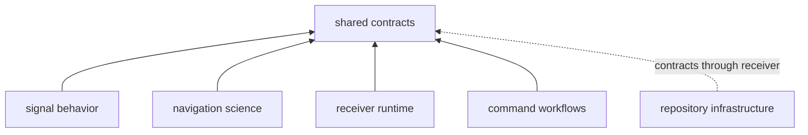
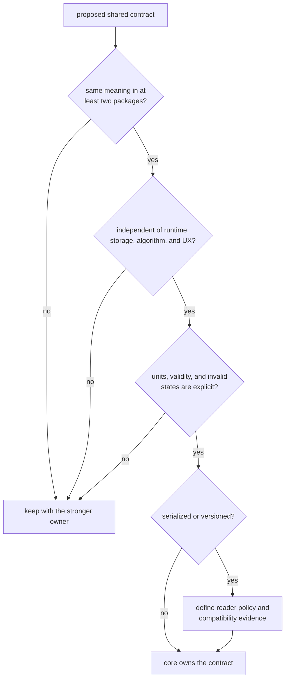

# Core Ownership Boundary

Core owns the meanings that GNSS packages must exchange without
reinterpretation. It does not own every type used by several packages, and it
does not become the owner of an algorithm merely because the algorithm returns
a shared record.

## What Core Positively Owns

The [contract map](../../../crates/bijux-gnss-core/docs/CONTRACT_MAP.md) groups
the current surface into these responsibilities:

| Shared responsibility | Core contribution |
| --- | --- |
| identity | constellations, satellites, signals, bands, components, and GLONASS channels |
| physical foundations | strong units, time systems, sample clocks, coordinates, and pure conversions |
| exchange records | acquisition, tracking, observation, differencing, navigation outcome, and support records |
| validity language | statuses, uncertainty classes, refusal reasons, diagnostics, and canonical errors |
| portable configuration | schema identity, composable configuration, and validation reports |
| artifact contracts | versioned envelopes, payload families, read policy, and semantic validation |
| shared conventions | pure Doppler, phase, observation, and solution sanity conventions |

Core’s production dependencies are limited to error support, complex numbers,
and serialization. It has no production dependency on another workspace
package and exposes no feature matrix. This low dependency floor lets every
higher package use the vocabulary without pulling in runtime, repository, or
command behavior.

The arrows show consumption, not ownership transfer. A navigation solution
record can live in core while the estimator, correction models, and acceptance
budgets remain in navigation.

## The Admission Test

A proposed type, invariant, or pure helper belongs in core only when all of the
following are true:

1. at least two packages need exactly the same meaning
2. producers and consumers agree on units, identity, frame, time system,
   validity, and failure semantics
3. the contract remains useful without a scheduler, filesystem layout,
   estimator implementation, signal algorithm, or command presentation
4. invalid states can be described and tested at the shared boundary
5. serialized behavior is explicit if the value crosses a process or release
   boundary

Similar local state is not yet shared meaning. Keep it local until packages
agree on semantics, not merely field names.

## Payload Meaning Is Not Storage

Core may own an artifact header, payload shape, schema version, and payload
validator. Infrastructure owns where that artifact is written, how runs are
identified, how manifests and history are committed, and how repository
provenance is recorded.

Likewise:

- core owns `SatId`; signal owns code generation and DSP for that signal
- core owns `TrackEpoch`; receiver owns tracking loops and lock transitions
- core owns `NavSolutionEpoch`; navigation owns the estimator and quality
  budget that produces it
- core owns `DiagnosticEvent`; command code owns rendering and exit policy

The distinction prevents persistence and runtime choices from becoming hidden
fields in supposedly portable records.

## Route Behavior To Its Stronger Owner

| Concern | Owning guide | Boundary reason |
| --- | --- | --- |
| signal catalogs, samples, code generation, and DSP | [Signal ownership](../../bijux-gnss-signal/foundation/ownership-boundary.md) | reusable signal behavior is not a generic contract |
| orbit products, corrections, estimators, PPP, RTK, and integrity | [Navigation ownership](../../bijux-gnss-nav/foundation/ownership-boundary.md) | scientific implementation and acceptance belong with navigation evidence |
| staged execution, channels, tracking sessions, and observations in motion | [Receiver ownership](../../bijux-gnss-receiver/foundation/ownership-boundary.md) | runtime state and scheduling are not portable vocabulary |
| datasets, run layout, manifests, provenance, and inspection | [Infrastructure ownership](../../bijux-gnss-infra/foundation/ownership-boundary.md) | repository state has persistence and operational semantics |
| commands, flags, output, and workflow composition | [Command ownership](../../bijux-gnss/foundation/ownership-boundary.md) | operator behavior is a public product boundary |

If a helper serves only one of these owners, leave it there even when its
arguments use core types.

## Public Does Not Mean Unbounded

Supported downstream imports pass through the
[curated public API](../../../crates/bijux-gnss-core/src/api.rs). Adding an item
there commits the workspace to a shared name and meaning. The current
[public-surface guardrail](../../../crates/bijux-gnss-core/tests/public_api_guardrail.rs)
finds public structs and free functions, but not every enum, trait, constant,
alias, method, or semantic compatibility change. Review remains necessary.

Before accepting a contract:

- name its contract family and stronger owner
- state units, frames, identity, validity, and invalid combinations
- document reader behavior when serialization is involved
- add direct semantic evidence, not only an export
- check the first producer and first consumer
- record compatibility impact

Core remains healthy when it provides one precise shared language while higher
packages retain their algorithms, effects, policy, and presentation.
