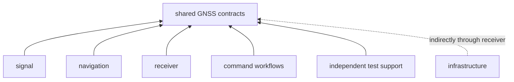
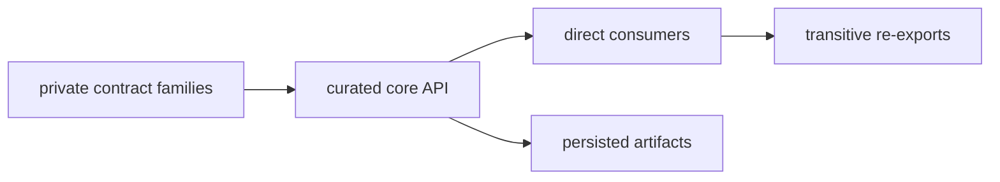

# Core Placement in the Package Graph

Core is the lowest GNSS workspace package. It has no production dependency on
another workspace package and no feature matrix. That placement keeps shared
contracts available without importing signal processing, runtime execution,
navigation science, repository effects, or command behavior.

## Direct Consumers

The current manifests define five direct workspace consumers:

Infrastructure does not declare core directly. It reaches shared contracts
through its receiver dependency and receiver re-exports. This matters when
reviewing dependency changes: an API may be visible transitively without being
an explicit package edge.

| Consumer | Core contracts used at the seam | Behavior retained by consumer |
| --- | --- | --- |
| signal | identities, samples, observations, units, tracking uncertainty | code generation, sample conversion, replicas, and DSP |
| navigation | observations, time, coordinates, differencing, outcomes, diagnostics | formats, corrections, orbit models, estimators, and integrity |
| receiver | acquisition, tracking, observation, artifact, configuration, and diagnostic records | scheduling, channels, stage execution, lock lifecycle, and runtime policy |
| command workflows | configuration, identities, artifacts, diagnostics, and report values | arguments, orchestration, rendering, files promised to users, and exit behavior |
| testkit | portable records used to build independent inputs and expected values | fixture design and oracle implementation |
| infrastructure, indirectly | artifact envelopes, payload validation, shared configuration, and diagnostics | datasets, provenance, run identity, persistence, history, and inspection |

## Supported Access Is Deliberate

Only the [curated public API](https://github.com/bijux/bijux-gnss/blob/main/crates/bijux-gnss-core/src/api.rs) is a
supported import surface. Private source modules express internal ownership;
their visibility is not a request for consumers to mirror the layout.

Transitive access is fragile. A package that semantically owns a direct
relationship with core should declare it rather than relying on another
package’s re-export. Conversely, a package should not add a direct dependency
merely to shorten imports when its existing owner already presents the correct
adapter.

## Why The Low Placement Matters

A core change can affect:

- source compatibility for every direct consumer
- serialized compatibility for stored artifacts
- validation and diagnostic interpretation
- numerical assumptions about units, frames, time, and sign
- transitive APIs exposed by receiver or infrastructure
- package publication and minimum Rust-version constraints

Core therefore optimizes for semantic stability and a small dependency floor,
not for rapid consolidation of helpers.

## Review A New Consumer Edge

A package should depend directly on core when it produces or consumes shared
contracts as part of its own public or internal semantics. Review:

1. which core family the package actually needs
2. whether an existing package adapter already owns the interaction
3. whether direct access would bypass validation or feature boundaries
4. whether the package is prepared for core compatibility changes
5. whether a narrower local record would preserve ownership better

Do not use direct core access to reach around signal, receiver, navigation, or
infrastructure APIs.

## Review A Core Change Across The Graph

Trace the change outward:

1. identify direct consumers of the changed export
2. locate transitive re-exports
3. identify serialized readers and writers
4. check the first producer and first independent consumer
5. record consumers that were inspected but not exercised

The [dependency guide](dependencies-and-adjacencies.md) explains the production
dependency floor. The [ownership boundary](ownership-boundary.md) decides
whether meaning belongs in core, and the
[test evidence guide](https://github.com/bijux/bijux-gnss/blob/main/crates/bijux-gnss-core/docs/TESTS.md) prevents a
guardrail pass from being overstated as downstream compatibility.

## Placement Smells

- core imports a workspace product package
- a consumer imports a private core module
- infrastructure is described as a direct consumer when the manifest is
  indirect
- a re-export is mistaken for ownership
- one command-specific type becomes shared vocabulary
- a core dependency introduces filesystem, network, runtime, or platform
  effects
- downstream code must reinterpret a unit, frame, validity, or refusal field

Core fits the repository when every consumer receives the same precise meaning
without importing behavior from an unrelated layer.
