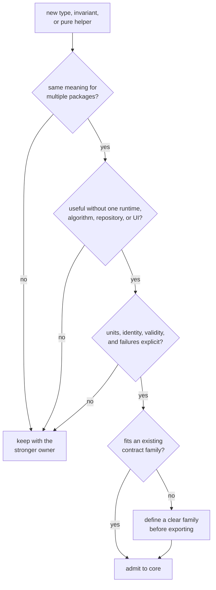
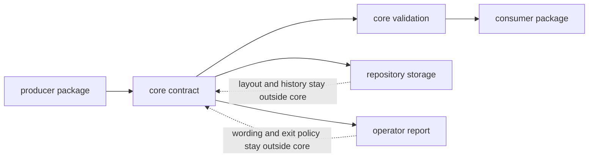

# Core Scope and Non-Goals

Core gives GNSS packages one portable language for identities, physical values,
observations, outcomes, diagnostics, and artifacts. It is not a home for code
that is merely reused, nor a neutral place to hide behavior whose real owner is
receiver, navigation, signal, infrastructure, or command workflows.

## What Belongs In Core

The [contract map](../../../crates/bijux-gnss-core/docs/CONTRACT_MAP.md)
identifies the current families:

| Contract family | Core-owned meaning |
| --- | --- |
| identities and support | constellations, satellites, signals, components, channels, and declared stage support |
| units, coordinates, and time | strong physical values, WGS-84 coordinate records, time systems, sample clocks, and pure conversions |
| acquisition and tracking | requests, results, explainability, seeds, epochs, transitions, lifecycle, and uncertainty |
| observations and differencing | sample frames, observation epochs, decisions, quality, covariance, single differences, and double differences |
| navigation outcomes | solution epochs, residuals, validity, refusal, lifecycle, and inter-system bias |
| diagnostics and errors | stable codes, severity, structured events, summaries, and canonical error categories |
| configuration | schema identity, composable shared configuration, and validation-report shape |
| artifacts | versioned envelopes, payload families, read policy, and semantic payload validation |
| pure conventions | shared Doppler, phase, coordinate, observation, solution, and statistical conventions |

The last row is intentionally narrow. Pure behavior belongs here when it
defines shared contract meaning. A coordinate transform can be foundational;
an estimator that chooses observations or updates state is not.

## Admission Requires Portable Meaning

Two packages having similar structs is not enough. They must agree on the same
units, frame, time system, ordering, validity, uncertainty, refusal, and
serialization meaning.

## Product Effect Model

Core may allocate, transform in-memory values, validate contracts, and
serialize or deserialize records. It must not acquire external state or decide
how effects are orchestrated.

Serialization support means a record can cross a process or release boundary.
It does not give core ownership of filenames, directories, dataset discovery,
manifest commits, command output, or recovery policy.

## Explicit Non-Goals

| Outside core | Stronger owner | Why |
| --- | --- | --- |
| spreading codes, replicas, sample conversion, correlation, and DSP | [Signal handbook](../../bijux-gnss-signal/) | these define reusable signal behavior |
| channel scheduling, acquisition execution, tracking loops, ports, and runtime metrics | [Receiver handbook](../../bijux-gnss-receiver/) | these require session state and runtime policy |
| decoders, ephemerides, corrections, orbit models, estimators, PPP, RTK, and integrity | [Navigation handbook](../../bijux-gnss-nav/) | these require scientific implementation evidence |
| datasets, provenance, run layout, manifests, history, and artifact discovery | [Infrastructure handbook](../../bijux-gnss-infra/) | these define repository state and persistence semantics |
| flags, workflow composition, output rendering, exit status, and operator guidance | [Command handbook](../../bijux-gnss/) | these are user-facing product behavior |
| independent expected values and fixture construction | [Testkit boundary](../../../crates/bijux-gnss-testkit/docs/BOUNDARY.md) | test oracles must remain independent of production contracts |

Core may define a record consumed by any of these owners. It must not absorb the
algorithm or effect that produces, stores, or presents the record.

## Common Scope Mistakes

- promoting a helper because two callers want the same implementation while
  their semantics differ
- placing a solver-specific state record in core before another consumer exists
- adding filesystem fields to an artifact payload instead of defining an
  infrastructure manifest
- embedding command remediation prose in shared diagnostics
- weakening units or validity to accommodate one downstream shortcut
- treating a public type as stable merely because it derives serialization
- adding a generic parameter that hides an unresolved ownership decision

## Review The Boundary

Before accepting a change:

1. name the producer and at least one independent consumer
2. place the meaning in the [contract catalog](../../../crates/bijux-gnss-core/docs/CONTRACTS.md)
3. state invalid combinations in the
   [invariant guide](../../../crates/bijux-gnss-core/docs/INVARIANTS.md)
4. define reader compatibility in the
   [serialization guide](../../../crates/bijux-gnss-core/docs/SERIALIZATION.md)
   when persisted
5. expose the item deliberately through the
   [public API](../../../crates/bijux-gnss-core/src/api.rs)
6. prove the contract in core and check its first producer and consumer

The scope is healthy when core remains understandable without knowing which
command ran, which estimator was chosen, where an artifact was stored, or how a
receiver session was scheduled.
