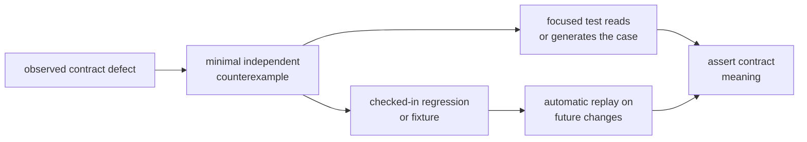
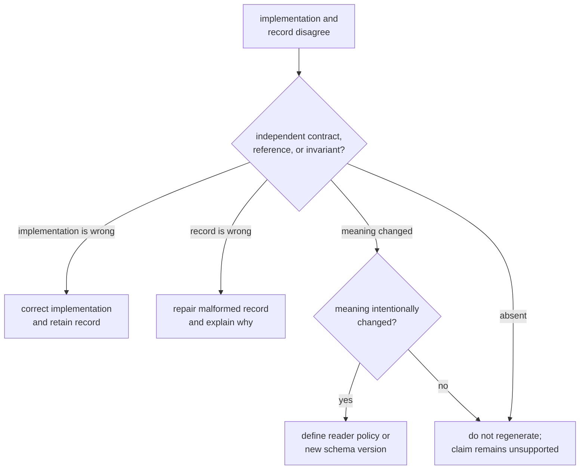

# Fixture and Regression Evidence

A checked-in record is evidence only when a test reads it and asserts the
contract it is meant to preserve. Core currently contains one active property
regression corpus and one dormant observation record. They require different
maintenance decisions.

## Current Evidence Status

| Record | Current status | Honest claim |
| --- | --- | --- |
| [Timekeeping regression corpus](https://github.com/bijux/bijux-gnss/blob/main/crates/bijux-gnss-core/tests/prop_timekeeping.proptest-regressions) | active; loaded automatically by the timekeeping property test | a previously minimized GPS-seconds counterexample is replayed before newly generated cases |
| [Observation JSONL record](https://github.com/bijux/bijux-gnss/blob/main/crates/bijux-gnss-core/tests/data/obs_fixture.jsonl) | dormant; no current source or test references it | a historical version-one observation example is retained, but no automated compatibility behavior is proved |

Do not describe dormant data as a fixture-backed test. Its presence can help a
future reader reconstruct an intended shape, but it does not prove parsing,
validation, round trip, or backward compatibility.

## Evidence Lifecycle

The checked-in record and the assertion have separate jobs. The record retains
the input; the test states why the input matters. Without the test, future
edits cannot distinguish a deliberate contract change from accidental data
churn.

## When to Change a Record

Change a regression or fixture only when one of these is true:

- the retained input is malformed relative to the contract it claims to
  exercise
- the contract meaning intentionally changes and compatibility policy explains
  the old reader or old record behavior
- an independent authority or minimized failure shows the expected value was
  wrong
- the record lacks information now required to make its scientific meaning
  explicit

Do not update it merely because a changed implementation produces different
bytes. First decide whether the implementation, expectation, schema, or
compatibility policy is wrong.

## Activate the Observation Record Properly

If the observation record is meant to become compatibility evidence, add a
test that:

1. reads the checked-in line through the supported reader path
2. asserts the schema version and artifact kind
3. validates units, identities, source time, decision metadata, and cross-field
   coherence
4. states whether exact bytes, semantic equality, or selected fields are the
   compatibility contract
5. proves the behavior for unsupported versions according to the read policy

Generating the expected value with the same serializer used by the test would
only prove self-consistency. Keep the retained input independent of the
implementation path being judged.

## Preserve Property Regressions

The timekeeping corpus is managed by the property-testing framework. Keep a
minimized failure seed when it exposes a durable invariant. Removing it
requires evidence that the generated domain or property no longer applies, not
only that the case now passes. If the property changes, explain whether its
domain became narrower, broader, or semantically different.

Use the [core test evidence guide](https://github.com/bijux/bijux-gnss/blob/main/crates/bijux-gnss-core/docs/TESTS.md)
for current coverage and the
[serialization contract](https://github.com/bijux/bijux-gnss/blob/main/crates/bijux-gnss-core/docs/SERIALIZATION.md)
when a record crosses a schema boundary.

A fixture change is ready when the record has an active reader, the assertion
names the preserved meaning, the expected result is independent, old-data
behavior is explicit, and dormant data is not presented as green evidence.
