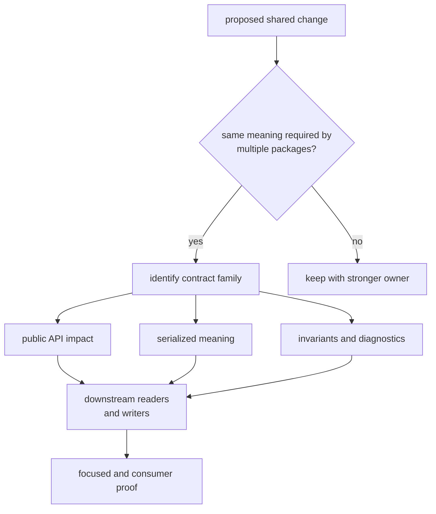
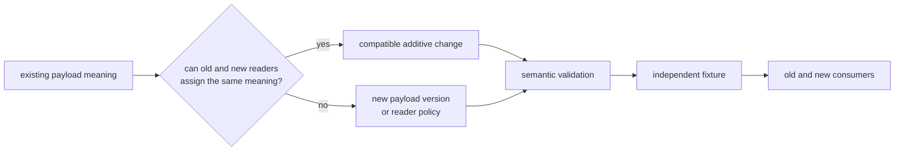

# Core Contract Change Guide

Change `bijux-gnss-core` only when several packages need one stable meaning.
Every public type, invariant, diagnostic, conversion, or serialized record can
affect signal, navigation, receiver, infrastructure, and command consumers.
Start with ownership and compatibility before editing code.

## Trace The Blast Radius

The cheapest safe outcome is often leaving a local concept with its existing
owner. Shared convenience is not enough to justify a core contract.

## Choose The Maintenance Route

| change | operational route | required decision |
| --- | --- | --- |
| New or changed shared type, identifier, unit, time, coordinate, or diagnostic | [Change sequence](change-sequence.md) | prove identical cross-package meaning and invalid states |
| Public export | [Common workflows](common-workflows.md) | name consumers, feature exposure, and compatibility burden |
| Artifact envelope, payload, validator, or conversion | [Fixture and regression care](fixture-and-regression-care.md) | define version, reader policy, semantic validation, and fixture provenance |
| Numerical or timekeeping behavior | [Verification commands](verification-commands.md) | use independent references, properties, edge cases, and derived tolerances |
| Change spanning several contract families | [Review scope](review-scope.md) | separate shared meaning from downstream runtime or scientific behavior |
| Published compatibility | [Release and versioning](release-and-versioning.md) | explain source, data, validation, and downstream impact |
| Focused local work | [Local development](local-development.md) | run the narrowest proof that can fail for the moved invariant |

## Evolve Persisted Meaning Explicitly

Do not change old serialized meaning in place. Parsing old bytes with a new
struct is not compatibility if units, defaults, status, or validity semantics
changed.

## Treat Fixtures As Evidence, Not Output

The retained timekeeping regression corpus is active property-test evidence.
The checked-in observation record is currently not referenced by tests or
source. It is dormant data, not an active serialization guarantee. Do not cite
it as round-trip or backward-compatibility proof until a reader test
deserializes and validates it.

When an active fixture changes:

- state which contract meaning made the old bytes wrong;
- preserve the old record when compatibility still matters;
- generate expectations independently of the writer under test;
- update validator, reader, and consumer evidence in the same coherent change.

## Commit And Review Boundary

A core commit is coherent when one contract family, its public and serialized
meaning, validators, documentation, focused proof, and necessary downstream
adaptations agree. Do not combine unrelated contract families merely because
they share a release version.

Before completion, confirm that no higher-package algorithm, runtime state,
repository layout, or command presentation leaked into core.

## Sources Of Truth

The [change rules](https://github.com/bijux/bijux-gnss/blob/main/crates/bijux-gnss-core/docs/CHANGE_RULES.md) define
ownership and evolution discipline. The
[serialization guide](https://github.com/bijux/bijux-gnss/blob/main/crates/bijux-gnss-core/docs/SERIALIZATION.md),
[contract map](https://github.com/bijux/bijux-gnss/blob/main/crates/bijux-gnss-core/docs/CONTRACT_MAP.md), and
[test guide](https://github.com/bijux/bijux-gnss/blob/main/crates/bijux-gnss-core/docs/TESTS.md) provide the
compatibility and evidence routes.
