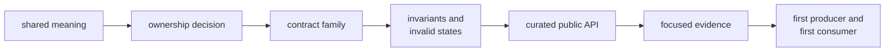
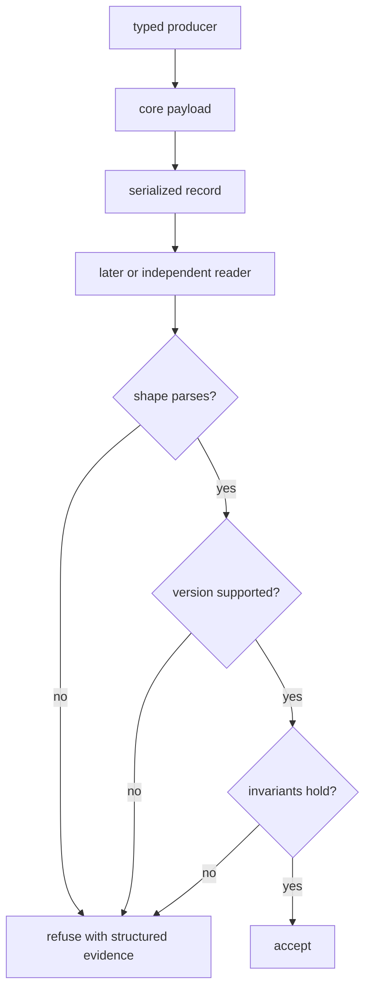

# Developing Shared GNSS Contracts

Start a core change from the meaning that packages must share, not from the
first downstream implementation that needs a convenient type. Core changes
propagate into signal processing, receiver execution, navigation, commands, and
serialized artifacts, so a locally tidy API can still create workspace-wide
ambiguity.

## Define The Contract Before The Type

Write down:

- producer and consumer packages
- physical units, coordinate frame, time system, and identity
- valid, degraded, refused, and absent states
- invariants that cannot be represented by field types alone
- whether the value is serialized or versioned
- the higher-level behavior that must remain outside core

Use the [ownership test](../foundation/ownership-boundary.md) before choosing a
module. The [contract map](https://github.com/bijux/bijux-gnss/blob/main/crates/bijux-gnss-core/docs/CONTRACT_MAP.md)
then identifies the existing family that should own the meaning.



Do not begin with a broad workspace run. It can reveal breakage later, but it
cannot decide whether the abstraction belongs in core.

## Follow The Change Surface

| Change | Read and update | Evidence to design |
| --- | --- | --- |
| identity, status, or ordering | [contract catalog](https://github.com/bijux/bijux-gnss/blob/main/crates/bijux-gnss-core/docs/CONTRACTS.md) and [invariants](https://github.com/bijux/bijux-gnss/blob/main/crates/bijux-gnss-core/docs/INVARIANTS.md) | exact examples, invalid values, ordering boundaries, and downstream interpretation |
| time, units, coordinates, or conventions | [numerical budgets](../quality/numerical-budgets.md) | reference examples, generated properties, domain boundaries, sign and frame checks |
| observation or navigation exchange record | owning contract family and first producer/consumer | coherent record, one-invariant-invalid records, uncertainty and refusal semantics |
| artifact payload or envelope | [serialization contract](https://github.com/bijux/bijux-gnss/blob/main/crates/bijux-gnss-core/docs/SERIALIZATION.md) | parse, semantic validation, unsupported version, old-data behavior, and round trip |
| diagnostic or error taxonomy | diagnostic catalog and consumers | stable code, severity, context, aggregation, and presentation-independent behavior |
| public export | [public API policy](https://github.com/bijux/bijux-gnss/blob/main/crates/bijux-gnss-core/docs/PUBLIC_API.md) | direct downstream-shaped use plus the surface guardrail |

Changing a field can affect several rows. For example, adding uncertainty to a
tracking record changes exchange semantics, serialized shape, payload
validation, and receiver consumers.

## Preserve Public Intent

Implementation modules are private; supported imports pass through
`bijux_gnss_core::api`. Before adding an export:

1. place the item in an existing contract family where possible
2. document its invariant and invalid states
3. decide whether downstream construction should be unrestricted
4. add semantic tests for enums, traits, constants, aliases, and methods
5. check the first real consumer instead of relying only on source scanning

The public-surface guardrail scans source text for public structs and free
functions. It is useful policy evidence, not a complete Rust API or
compatibility analysis.

## Treat Serialization As A Reader Contract



The current artifact policy accepts schema version one. A conversion symbol for
a later version exists, but no later schema or migration is implemented.
Therefore:

- do not assign new meaning silently to version one
- do not cite the conversion symbol as migration support
- define compatibility and loss before introducing another version
- distinguish structural deserialization from semantic payload validity
- activate a checked-in fixture with a reader test before calling it regression
  evidence

The [serialization guide](https://github.com/bijux/bijux-gnss/blob/main/crates/bijux-gnss-core/docs/SERIALIZATION.md)
records current evidence gaps, including the dormant observation fixture.

## Select The Narrow Proof

The [test evidence guide](https://github.com/bijux/bijux-gnss/blob/main/crates/bijux-gnss-core/docs/TESTS.md) maps
current coverage and its limits. Representative commands are:

```console
cargo test -p bijux-gnss-core --test public_api_guardrail
cargo test -p bijux-gnss-core --test nav_artifact_validation
cargo test -p bijux-gnss-core --test tracking_artifact_validation
cargo test -p bijux-gnss-core --test prop_timekeeping
```

Choose the target that protects the changed claim. Add focused evidence when no
existing target does. A package-wide pass does not establish receiver accuracy,
navigation convergence, persistence behavior, or exhaustive artifact
compatibility.

For numerical contracts, make units and frames visible in the test, derive
tolerances from the claimed budget, and cover boundaries rather than only a
comfortable nominal value. For payload contracts, construct one coherent
record and then violate one invariant at a time so diagnostics remain
attributable.

## Check The First Consumers

After core evidence is coherent, inspect the first producer and consumer:

- signal for identities, samples, and observation validation
- receiver for acquisition, tracking, observation, and artifact records
- navigation for solution, residual, differencing, time, and coordinate
  contracts
- command workflows for public configuration, diagnostics, and output records
- infrastructure for persisted envelopes and repository adapters, usually
  reached through receiver

Confirm that each package uses the same units, validity, and failure meaning.
Do not weaken a core invariant to preserve an incorrect downstream assumption;
correct the consumer or keep the specialized type with that owner.

## Finish With An Explicit Claim

A reviewable core change states:

- why the meaning belongs in core
- which public and serialized contracts changed
- what focused evidence passed
- which producer and consumer were checked
- what compatibility or coverage gap remains

The local loop is complete when the shared meaning is precise before and after
serialization, the public surface is deliberate, and downstream packages do
not need to reinterpret it.
