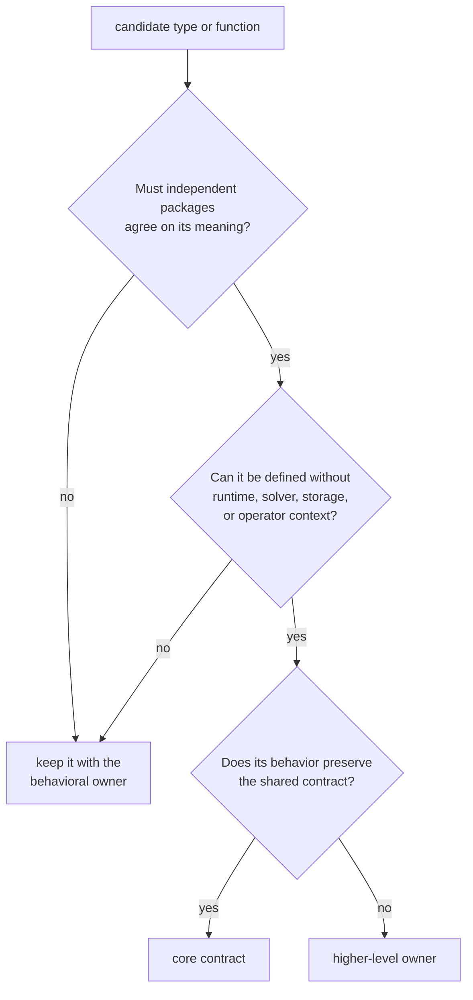
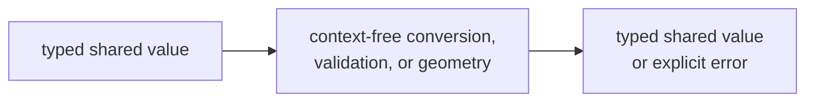
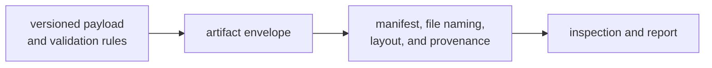

# Shared Contract Ownership Boundaries

`bijux-gnss-core` gives packages a common language for identities, units,
time, observations, diagnostics, configuration, navigation solutions, and
versioned artifact payloads. It may also own pure behavior required to preserve
that language, such as conversion, validation, serialization, and geometry.

Core is not a destination for every type used by multiple packages. A concept
belongs here only when consumers must agree on its meaning independently of
one runtime, algorithm, storage layout, or command.

## Decide By Meaning

Good core candidates include:

- identities and enums exchanged across package boundaries;
- strongly typed physical quantities and explicit time systems;
- observation, tracking, acquisition, and navigation result records;
- diagnostic codes and canonical error categories;
- configuration records with context-free validation;
- artifact headers, versioned payload shapes, and payload validators;
- deterministic conversions and geometry that define shared units or frames.

## Separate Contract From Policy

| shared contract in core | policy or behavior owned elsewhere |
| --- | --- |
| signal identity, component role, carrier constants, and registry record types | [signal processing](../bijux-gnss-signal/) owns registry contents, code generation, sample behavior, replicas, and DSP |
| acquisition and tracking request, result, lifecycle, uncertainty, and diagnostic records | [receiver execution](../bijux-gnss-receiver/) owns stage scheduling, lock decisions, reacquisition, and channel policy |
| navigation solution, residual, refusal, and provenance records | [navigation science](../bijux-gnss-nav/) owns parsing, orbit models, corrections, estimators, and solution acceptance |
| artifact headers and versioned payload validation | [repository infrastructure](../bijux-gnss-infra/) owns file discovery, run layout, manifests, provenance hashing, and persistence |
| configuration structures and validation reports | [command workflows](../bijux-gnss/) own operator syntax, workflow defaults, and report presentation |

The fact that core defines a lifecycle enum does not mean it decides when a
receiver changes state. The fact that core defines an artifact envelope does
not mean it chooses a directory or writes a file.

## Pure Behavior Is Allowed

The old shorthand “core owns meaning, not behavior” is insufficient. Some
behavior is inseparable from shared meaning:

- converting typed units without changing physical quantity;
- transforming between documented coordinate frames;
- converting explicit time systems with a supplied leap-second table;
- validating a versioned payload against its schema invariants;
- serializing a stable cross-package record;
- applying sanity checks whose assumptions are part of the shared contract.

Behavior does not belong in core when it needs channel history, solver state,
dataset discovery, process environment, filesystem layout, or operator intent.

## Signal Identity Boundary

Core exports signal identity types, component metadata structures, and shared
carrier constants through the
[public core facade](../../crates/bijux-gnss-core/src/api.rs). The signal
package uses those contracts to build canonical registry entries and implement
code and sample behavior.

Keep a field in core when every signal consumer must interpret it identically.
Keep registry selection, signal-family assignments, modulation, and sampling
in signal. This avoids both duplicate identity types and a core package coupled
to constellation implementation detail.

## Artifact Boundary

Core owns the first two nodes. Infrastructure owns persistence. The command
package owns operator presentation. A request to add a file path, run
directory, or discovery rule to a payload should be challenged unless the
value is genuinely part of the portable record.

## Dependency Constraint

Core must remain below signal, navigation, receiver, infrastructure, and
command packages. Its manifest and
[dependency guardrail](../../crates/bijux-gnss-core/tests/integration_guardrails.rs)
are stronger evidence than an architecture diagram.

If a proposed core helper needs a higher-level workspace dependency, move the
behavior upward or extract a smaller context-free contract. Do not use feature
flags to hide an inverted ownership edge.

## Admission Questions

Before adding or widening a core contract, answer:

1. Which independent packages exchange this value?
2. What exact meaning must those packages share?
3. Which units, frames, time systems, validity states, and version rules are
   explicit?
4. Can the invariant be tested without runtime, filesystem, or solver state?
5. Would a higher owner lose necessary policy if this moved into core?
6. Can the contract evolve without exposing one implementation's internals?

Use the [contract map](../../crates/bijux-gnss-core/docs/CONTRACT_MAP.md),
[public API guide](../../crates/bijux-gnss-core/docs/PUBLIC_API.md), and
[change rules](../../crates/bijux-gnss-core/docs/CHANGE_RULES.md) to assess
downstream impact. Shared use is evidence of a boundary; it is not proof that
core is the correct one.
