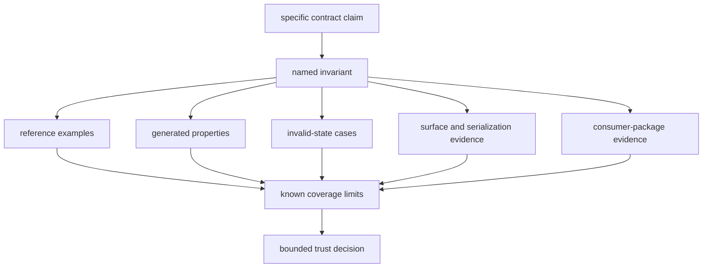
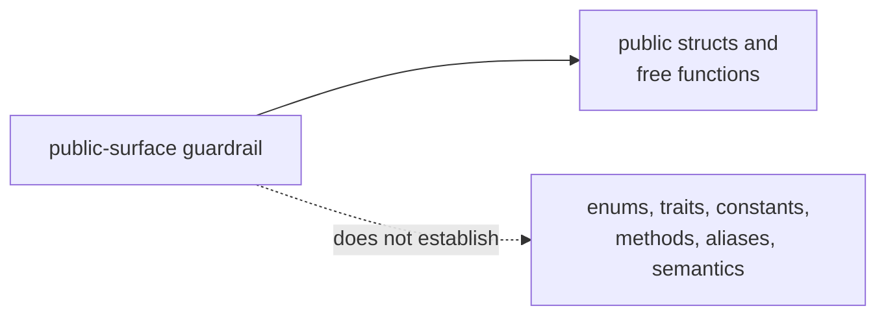

# Core Evidence Guide

Core sits beneath every GNSS product package, so a weak claim here propagates
widely. Quality means matching each shared-contract claim to evidence that
actually exercises its domain, while recording gaps that compilation and
representative examples cannot expose.

## Build A Trust Decision

No single layer is sufficient. Examples explain intended behavior, properties
explore a domain, negative tests prove rejection, compatibility evidence
protects readers, and downstream tests prove that a real consumer uses the
contract correctly.

## Select Evidence By Change

| change | minimum evidence route | common overclaim |
| --- | --- | --- |
| Identity, ordering, status, or version | exact examples, boundaries, invalid lookups, and serialization when applicable | one happy-path equality proves the full domain |
| Time, units, or coordinates | independent reference points, algebraic properties, edge cases, and derived tolerances | a round trip at one coordinate proves global accuracy |
| Observation, tracking, or navigation record | coherent payload plus one-invariant-at-a-time invalid cases | deserialization proves semantic validity |
| Public export | curated-surface guardrail plus consumer-shaped compilation and semantic test | a `pub` declaration is a supported contract |
| Versioned artifact | old-reader policy, payload validation, fixture provenance, and conversion evidence | a current writer and reader prove compatibility |
| Receiver or navigation behavior | proof in the owning package | core record coherence proves algorithm accuracy |

Use [invariants](invariants.md) to name the promise,
[test strategy](test-strategy.md) to choose the proof layer,
[numerical budgets](numerical-budgets.md) for tolerances, and
[change validation](change-validation.md) for the minimum review route.

## Current Evidence Has Boundaries

The public-surface guardrail scans source text. It does not perform Rust API
analysis and does not prove semantic stability. Add direct evidence for enums,
traits, constants, methods, aliases, and feature-gated behavior.

Current property coverage for time and coordinates is useful but not exhaustive
across leap boundaries, week rollover, poles, antimeridian behavior, invalid
rates, or all time-system conversions. Selected navigation and tracking
artifact validators do not cover every acquisition, observation, support, or
conversion payload.

The checked-in observation fixture is not referenced by current tests or
source. Until a reader deserializes and validates it, it is dormant data rather
than compatibility evidence.

## Review Failure Signals

- A test reproduces the implementation under test instead of using an
  independent expectation.
- A fixture changes without a statement of which contract meaning changed.
- A tolerance is widened until a failure disappears.
- A parser or schema check is cited as scientific validation.
- A public-surface test is described more broadly than the symbols it inspects.
- A higher-package failure is silenced by weakening a shared invariant.

Use [known limitations](known-limitations.md) and the
[risk register](risk-register.md) to preserve unresolved exposure, then apply
the [review checklist](review-checklist.md) and
[definition of done](definition-of-done.md) before claiming completion.

## Evidence Sources

The [core test guide](https://github.com/bijux/bijux-gnss/blob/main/crates/bijux-gnss-core/docs/TESTS.md) documents
current proof and gaps. The
[invariant guide](https://github.com/bijux/bijux-gnss/blob/main/crates/bijux-gnss-core/docs/INVARIANTS.md) states
downstream assumptions. Concrete evidence includes the
[public API guardrail](https://github.com/bijux/bijux-gnss/blob/main/crates/bijux-gnss-core/tests/public_api_guardrail.rs),
[navigation artifact validation](https://github.com/bijux/bijux-gnss/blob/main/crates/bijux-gnss-core/tests/nav_artifact_validation.rs),
[tracking artifact validation](https://github.com/bijux/bijux-gnss/blob/main/crates/bijux-gnss-core/tests/tracking_artifact_validation.rs),
and [timekeeping properties](https://github.com/bijux/bijux-gnss/blob/main/crates/bijux-gnss-core/tests/prop_timekeeping.rs).
