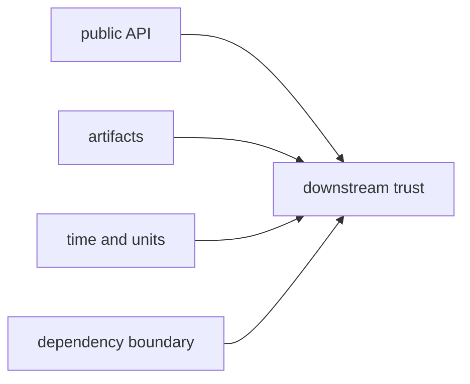

# Invariants

The most important `bijux-gnss-core` invariants are the ones downstream crates
quietly depend on every day.

## Invariant Map

## Invariant Families

| family | invariant | proof |
| --- | --- | --- |
| public surface | stable core meaning is deliberately re-exported through `src/api.rs` | public API guardrail |
| private layout | callers do not need private module paths for stable contracts | public API guardrail |
| artifacts | payload validators enforce semantic coherence, not just parse shape | artifact validation tests |
| numeric evidence | non-finite or internally inconsistent persisted values are rejected rather than normalized silently | artifact validation tests |
| support inventory | support-matrix and navigation payloads remain versioned records | artifact and serialization tests |
| timekeeping | GPS, UTC, TAI, leap-second, and sample-trace conversions remain deterministic | property tests and regression corpus |
| dependency boundary | core stays free of higher-level workspace crate dependencies | integration guardrails |
| ownership boundary | core remains a foundation rather than runtime or repository policy | contract map and review-scope docs |

## Failure Signals

- A downstream crate imports a private core module for stable meaning.
- A serialized artifact accepts non-finite or contradictory values.
- A new core type duplicates a receiver, nav, signal, infra, or command concept.
- A time conversion passes examples but fails property-test edge cases.
- A core dependency points upward into a product or workflow crate.

## First Proof Check

Start with the core [invariants guide](https://github.com/bijux/bijux-gnss/blob/main/crates/bijux-gnss-core/docs/INVARIANTS.md)
and [contract map](https://github.com/bijux/bijux-gnss/blob/main/crates/bijux-gnss-core/docs/CONTRACT_MAP.md).
Then confirm enforcement through the [public API guardrail](https://github.com/bijux/bijux-gnss/blob/main/crates/bijux-gnss-core/tests/public_api_guardrail.rs),
[navigation artifact validation](https://github.com/bijux/bijux-gnss/blob/main/crates/bijux-gnss-core/tests/nav_artifact_validation.rs),
[tracking artifact validation](https://github.com/bijux/bijux-gnss/blob/main/crates/bijux-gnss-core/tests/tracking_artifact_validation.rs),
[timekeeping property tests](https://github.com/bijux/bijux-gnss/blob/main/crates/bijux-gnss-core/tests/prop_timekeeping.rs),
and [integration guardrails](https://github.com/bijux/bijux-gnss/blob/main/crates/bijux-gnss-core/tests/integration_guardrails.rs).
