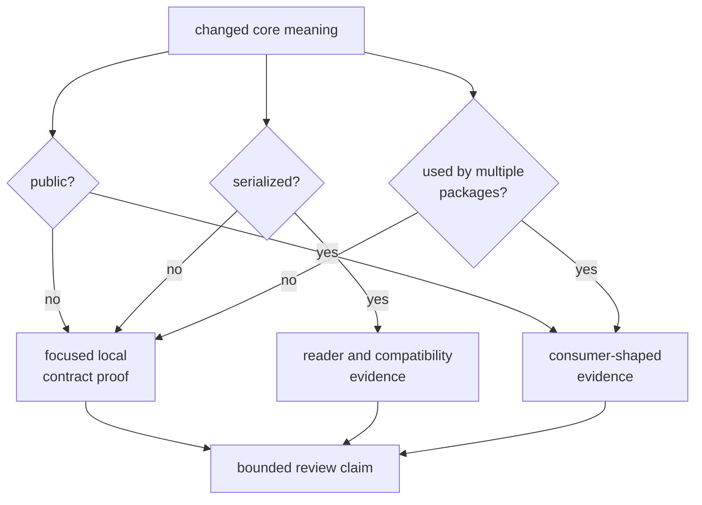
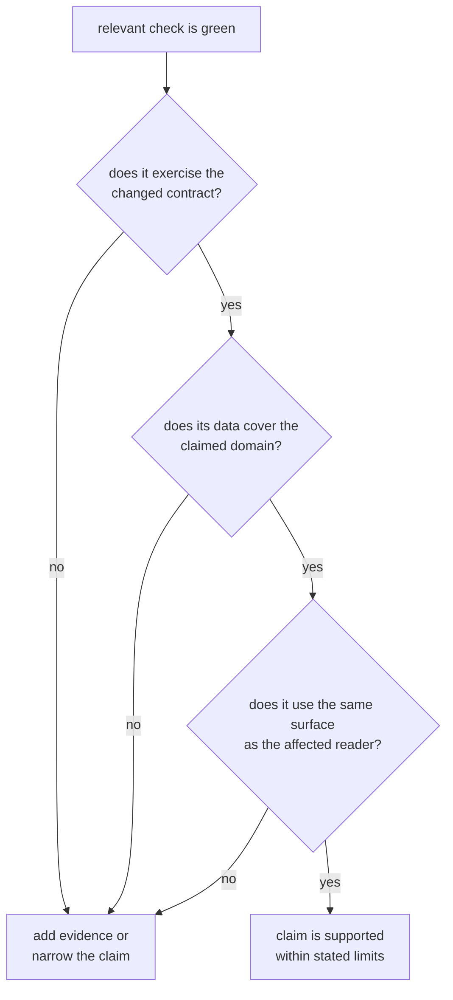

# Core Evidence Risks

Core test failures are usually visible. The more dangerous failure is a green
check cited for a claim it does not exercise. Because every product package can
consume core contracts, weak evidence at this layer spreads ambiguity without
necessarily causing an immediate runtime failure.

## Evaluate Risk by Contract Reach

A change may need all three evidence routes. “The core suite passes” does not
say which route was exercised.

## Active Risk Register

| Risk | Observable warning | Required response | Residual limit |
| --- | --- | --- | --- |
| Partial public-surface detection | A new enum, trait, constant, alias, method, or semantic change is justified only by the public guardrail. | Add direct public use and review the curated API contract. | The guardrail scans source text for public structs and free functions; it is not complete Rust API analysis. |
| Representative artifact proof treated as exhaustive | Navigation or tracking validation passes and is cited for every payload family. | Add a coherent case and one-invariant-invalid cases for the changed payload. | Existing suites cover selected navigation and tracking rules, not every artifact or historical schema. |
| Dormant fixture presented as compatibility | A checked-in record is named, but no test reads it. | Add an independent reader and explicit compatibility assertions, or label the data dormant. | The current observation JSONL record remains unreferenced. |
| Narrow property domain presented as universal | Generated time cases pass, but boundary systems or invalid inputs are absent. | Extend generators and add independent boundary examples for the changed domain. | Current time properties emphasize positive GPS seconds and positive sample rates. |
| Numeric tolerance hides discrete drift | A broad epsilon permits changed identity, status, ordering, version, or refusal. | Assert discrete contracts exactly and derive tolerances only for named numeric quantities. | Passing nearby values does not prove unit, frame, or model identity. |
| Diagnostic compatibility drifts | Code, severity, or context meaning changes while only message text is inspected. | Assert the structured fields consumers use and review serialized readers. | Context keys are string pairs rather than a typed per-code schema. |
| Downstream assumption is undocumented | A consumer relies on a default, ordering, invalid state, or conversion absent from core invariants. | Name the invariant and add consumer-shaped evidence, or narrow the public promise. | Compilation cannot reveal semantic reinterpretation. |
| Workflow evidence is attributed to core | A valid record is used to claim receiver, navigation, persistence, or command correctness. | Pair core coherence proof with evidence from the package that executes the behavior. | Core does not own those workflows. |

The [core test evidence guide](https://github.com/bijux/bijux-gnss/blob/main/crates/bijux-gnss-core/docs/TESTS.md)
documents the current coverage in detail. The
[invariant guide](https://github.com/bijux/bijux-gnss/blob/main/crates/bijux-gnss-core/docs/INVARIANTS.md) records
intended downstream assumptions; neither should be cited beyond its stated
domain.

## Triage a Green Result

This review is especially important for source-scanning guardrails and
self-generated fixtures. They can be useful checks while remaining weak
semantic authorities.

## Block the Change When

- serialized meaning moves without explicit old-reader behavior
- an expected record is regenerated from the serializer it is intended to
  judge
- a public contract is widened for one consumer without a shared semantic
  argument
- a representative payload test is described as complete compatibility
- units, frames, time systems, defaults, invalid states, or ordering remain
  implicit
- a diagnostic consumer must parse message prose to recover stable meaning
- a core test is the only evidence for behavior executed by another package

## Record Risk Honestly

When evidence cannot be added in the same change, state:

1. the exact unsupported claim
2. the packages or persisted readers exposed to it
3. the current evidence and why it is insufficient
4. the narrower claim that remains supported
5. the durable owner of the missing proof

Do not downgrade a known gap to “low risk” because no failure has been
observed. Risk depends on contract reach, detectability, and recovery cost.

A core quality review is complete when each claim names the exercised
contract, input domain, reader surface, compatibility boundary, downstream
owner, and residual gap.
